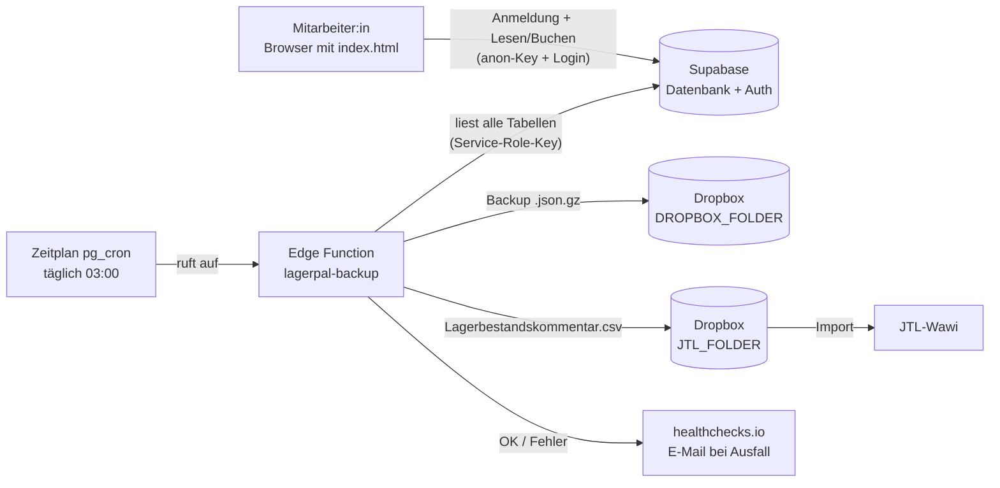

# LagerPal – Handbuch

**Lagerverwaltung im Browser mit Supabase, automatischer Dropbox-Sicherung und JTL-Anbindung**

Stand: Oktober 2026 · erstellt anhand des Quellcodes (`index.html`, `supabase/00_KOMPLETT_neu_aufsetzen.sql`, `supabase/functions/lagerpal-backup/index.ts`)

> **Hinweis:** Alle Menünamen, Knopfbeschriftungen und Meldungen in diesem Handbuch sind wörtlich aus dem Programmcode übernommen. Stellen, die sich aus dem Code nicht eindeutig ergeben, sind mit **„Hinweis: bitte prüfen"** gekennzeichnet. Eine Sammelliste dieser Stellen steht in [Anhang D](#anh-d).

---

<a id="inhalt"></a>
## Inhaltsverzeichnis

1. [Einleitung](#kap-1)
    - [1.1 Wofür ist LagerPal da?](#k1-1)
    - [1.2 Für wen ist dieses Handbuch?](#k1-2)
    - [1.3 Glossar – die wichtigsten Begriffe](#k1-3)
2. [Systemüberblick (für Nicht-Techniker)](#kap-2)
3. [Einrichtung Schritt für Schritt](#kap-3)
    - [3.1 Voraussetzungen](#k3-1)
    - [3.2 Supabase-Projekt anlegen](#k3-2)
    - [3.3 Datenbank aufsetzen (SQL-Datei)](#k3-3)
    - [3.4 JTL-Artikelliste laden (optional)](#k3-4)
    - [3.5 Benutzer anlegen – Anmeldung und Rollen](#k3-5)
    - [3.6 index.html bereitstellen (Hosting)](#k3-6)
    - [3.7 Erste Verbindung: Project URL und anon-Key](#k3-7)
    - [3.8 anon-Key und Service-Role-Key – der Unterschied](#k3-8)
    - [3.9 Dropbox-App anlegen und Refresh-Token erzeugen](#k3-9)
    - [3.10 Edge Function deployen und Secrets setzen](#k3-10)
    - [3.11 healthchecks.io einrichten](#k3-11)
    - [3.12 Zeitplan (Cron) für das tägliche Backup](#k3-12)
    - [3.13 Alle Zugangsdaten und wo sie eingetragen werden](#k3-13)
    - [3.14 Abschluss-Checkliste](#k3-14)
4. [Bedienung](#kap-4)
    - [4.1 Anmelden, Abmelden, Verbindung ändern](#k4-1)
    - [4.2 Aufbau der Oberfläche](#k4-2)
    - [4.3 Reiter „Suche"](#k4-3)
    - [4.4 Artikel anlegen, bearbeiten, löschen](#k4-4)
    - [4.5 Reiter „Scanner" – Einbuchen (Wareneingang)](#k4-5)
    - [4.6 Reiter „Scanner" – Ausbuchen (Entnahme)](#k4-6)
    - [4.7 Unbekannte Artikel und JTL-Artikelliste](#k4-7)
    - [4.8 Reiter „Umlagern"](#k4-8)
    - [4.9 Reiter „Inventur" (Zählen)](#k4-9)
    - [4.10 Reiter „Lagerplätze" (inkl. Paletten)](#k4-10)
    - [4.11 Reiter „Palette sortieren"](#k4-11)
    - [4.12 Reiter „Protokoll"](#k4-12)
    - [4.13 Reiter „Import/Export"](#k4-13)
    - [4.14 Reiter „Übersicht"](#k4-14)
    - [4.15 Leermeldungen (Glocke)](#k4-15)
    - [4.16 Rückgängig-Leiste](#k4-16)
    - [4.17 Drucken: Karton-Blatt, Etiketten, Pickliste](#k4-17)
5. [Datensicherung und Wiederherstellung](#kap-5)
6. [JTL-Anbindung](#kap-6)
7. [Fehlerbehebung und FAQ](#kap-7)
8. [Wartung](#kap-8)
9. [Anhang](#kap-9)
    - [A – Datenbanktabellen und Sichten](#anh-a)
    - [B – Datenbankfunktionen](#anh-b)
    - [C – Buchungstypen im Protokoll](#anh-c)
    - [D – Liste aller „bitte prüfen"-Stellen](#anh-d)

---

<a id="kap-1"></a>
## 1. Einleitung

<a id="k1-1"></a>
### 1.1 Wofür ist LagerPal da?

LagerPal ist eine Lagerverwaltung, die vollständig im Webbrowser läuft (Titel der Seite: „LagerPal (Web)"). Sie beantwortet die Frage **„Welcher Artikel liegt wie oft auf welchem Lagerplatz bzw. in welchem Karton?"** und protokolliert jede Bewegung.

Die wichtigsten Aufgaben:

- **Ein- und Ausbuchen** per Barcode-Scanner (Reiter „📟 Scanner") oder direkt aus der Artikelsuche.
- **Umlagern** von einem Lagerplatz auf einen anderen.
- **Inventur**: gezählte Mengen je Lagerplatz übernehmen.
- **Palette sortieren**: eine angelieferte Quelle (z. B. eine Mischpalette) ausräumen und die Artikel – gesteuert durch den Amazon-Status – automatisch in „online"- und „nicht online"-Kartons einsortieren, inklusive Sprachansage und Karton-Blatt.
- **Leermeldungen** („Glocke"): Hinweis, sobald ein Artikel auf einem Platz leer geworden ist.
- **Import/Export**: Bestände und Amazon-Status per CSV/Excel einlesen, Bestände im JTL-Format exportieren.
- **Datensicherung**: manueller Download und – über eine Supabase Edge Function – tägliche automatische Sicherung nach Dropbox sowie täglicher Export des JTL-Lagerbestandskommentars.

<a id="k1-2"></a>
### 1.2 Für wen ist dieses Handbuch?

- **Lager-Mitarbeiter:innen** finden die Bedienung in [Kapitel 4](#kap-4).
- **Wer das System betreut oder neu aufsetzen muss**, findet die Einrichtung in [Kapitel 3](#kap-3), Sicherung in [Kapitel 5](#kap-5) und Wartung in [Kapitel 8](#kap-8).
- **Büro/Warenwirtschaft (JTL)**: [Kapitel 6](#kap-6).

<a id="k1-3"></a>
### 1.3 Glossar – die wichtigsten Begriffe

| Begriff | Bedeutung in LagerPal |
|---|---|
| **Artikel** | Ein Produkt mit eindeutiger **Artikelnummer** (z. B. aus JTL), einem **Artikelnamen** und optional einer **GTIN/EAN**. |
| **Artikelnummer / SKU** | Eindeutiger Schlüssel eines Artikels. In der Oberfläche teils „SKU" genannt (z. B. „12 SKUs" = 12 verschiedene Artikel). |
| **GTIN / EAN** | Barcode-Nummer des Herstellers. Eine EAN darf bei **mehreren** Artikeln eingetragen sein (z. B. Original und „defekt"-Zweitartikel). Beim Scannen erscheint dann „EAN mehrdeutig" und man gibt die Artikelnummer ein. |
| **Set-Artikel** | Artikel, bei dem mehrere Teile zusammen **ein** Stück bilden. Wird mit rotem „SET"-Abzeichen gezeigt; beim Buchen erscheint eine Warnung. |
| **Amazon-Status** | Kennzeichen je Artikel: **online** (1), **nicht online** (2) oder **unbekannt** (0). Steuert bei „Palette sortieren", in welchen Karton ein Artikel kommt. Anzeige als Abzeichen „AMA" (grün), „AMA" durchgestrichen (rot) oder „AMA ?" (grau). |
| **Lagerplatz** | Ein Ort, an dem Ware liegt – frei benennbar (z. B. Regalfach, Kiste, Karton). Technisch sind „Lagerplatz" und „Karton" dasselbe. |
| **Karton** | Ein Lagerplatz, dem zusätzlich eine **Palette** und ein **Kanal** zugeordnet sein können. Bei „Palette sortieren" heißen neue Kartons `<Palette>-K01`, `-K02` … (z. B. `P01-K01`). |
| **Palette** | Gruppierung von Kartons (z. B. `P01` bis `P40`). Paletten werden im Reiter „📦 Lagerplätze" unter „🎨 Paletten verwalten" gepflegt. |
| **Kanal** | Kennzeichen eines Kartons: **gemischt** (0), **online** (1) oder **nicht online** (2). |
| **Bestand** | Menge eines Artikels auf einem Lagerplatz. Kann nie negativ werden (die Datenbank verhindert das). Ein Bestand von 0 bleibt als „früherer Lagerort" sichtbar (grau). |
| **Gesamtbestand** | Summe eines Artikels über alle Lagerplätze. |
| **Buchung** | Jede Bestandsänderung bzw. Verwaltungsaktion wird als Eintrag im **Protokoll** gespeichert (Tabelle `buchungen`). Typen: siehe [Anhang C](#anh-c). |
| **Eingang / Ausgang** | Einbuchen (Zugang) bzw. Ausbuchen (Entnahme) auf einem Lagerplatz. |
| **Umlagerung** | Menge von Platz A nach Platz B verschieben. |
| **Inventur** | Gezählte Ist-Menge übernehmen; die Differenz wird als Typ „Inventur" protokolliert. |
| **Inventur-Zugang (Einräumen)** | Bei „Palette sortieren": mehr gescannt, als laut Bestand auf der Quelle lag – der Überschuss wird als Eingang gebucht. |
| **Quelle** | Bei „Palette sortieren" der Lagerplatz, der ausgeräumt wird. |
| **Leermeldung** | Meldung „Artikel X auf Platz Y ist leer", automatisch erzeugt, wenn ein Bestand von >0 auf 0 fällt. Sichtbar über die **Glocke** 🔔 oben rechts. |
| **Einräum-Hinweis** | Besondere Leermeldung nach „✓ Palette fertig", wenn auf der Quelle noch Bestand gebucht ist, der nicht gefunden wurde. |
| **Unbekannter Artikel** | Platzhalter, der automatisch angelegt wird, wenn eine EAN gescannt wird, die weder in LagerPal noch (eindeutig) in der JTL-Artikelliste steht. Nummer `WE-0-230`, `WE-0-231` …, Name „Unbekannt 1", „Unbekannt 2" … |
| **Klärfall-Karton** | Lagerplatz `Unbekannt-01`, `Unbekannt-02` …, in den unbekannte Artikel immer gebucht werden. |
| **JTL-Artikelliste** | Nachschlage-Tabelle mit dem kompletten JTL-Artikelstamm (ohne Set-Artikel). Wird nur beim Scannen unbekannter EANs benutzt. |
| **Lagerbestandskommentar** | CSV für JTL mit Spalten `Artikelnummer;Kommentar`, Kommentar z. B. `P01-K03 (5), R2-F4 (1)`. |
| **Rückgängig** | Zurücknehmen der **letzten** umkehrbaren Aktion (höchstens 2 Stunden alt) über die gelbe Leiste unten. |
| **Teil-Import / Komplett-Import** | Arten des Bestandsimports (siehe [4.13](#k4-13)). |
| **Vollabgleich** | Art des Amazon-Status-Imports: alle Artikel, die nicht in der Datei stehen, werden „nicht online". |
| **Pickliste** | Druckliste der ausgewählten Artikel mit Lagerplatz, Menge, EAN, Name. |
| **Karton-Blatt** | DIN-A4-Inhaltsliste eines Kartons mit großem Kartonnamen und farbigem Kanal-Punkt. |

---

<a id="kap-2"></a>
## 2. Systemüberblick (für Nicht-Techniker)

LagerPal besteht aus wenigen, klar getrennten Bausteinen:

| Baustein | Was es ist | Aufgabe |
|---|---|---|
| **Browser-App** (`index.html`) | Eine einzige Webseite (HTML/CSS/JavaScript). | Die Oberfläche, die im Lager und im Büro benutzt wird. Sie spricht **direkt** mit Supabase – es gibt keinen eigenen Server dazwischen. |
| **Supabase** | Gehosteter Datenbank-Dienst (PostgreSQL) mit Anmeldung (Auth). | Speichert alle Daten, prüft die Anmeldung und erlaubt Änderungen **nur** über geprüfte Datenbankfunktionen. |
| **Edge Function** `lagerpal-backup` | Kleines Programm, das bei Supabase läuft. | Erstellt täglich eine Sicherung und den JTL-Kommentar-Export und lädt beides nach Dropbox. |
| **Zeitplan (pg_cron)** | Zeitgesteuerter Auftrag in der Datenbank. | Ruft die Edge Function einmal täglich (03:00 Uhr deutscher Zeit) auf. Muss separat eingerichtet werden ([3.12](#k3-12)). |
| **Dropbox** | Cloud-Speicher. | Ablage der Sicherungen (`DROPBOX_FOLDER`) und der JTL-CSV (`JTL_FOLDER`). |
| **JTL** | Warenwirtschaft. | Liest den Lagerbestandskommentar aus der CSV-Datei ein. |
| **healthchecks.io** | Überwachungsdienst. | Bekommt nach jedem Lauf ein „OK" oder „Fehler"; bleibt die Meldung aus, verschickt er eine E-Mail. |



Dieselbe Darstellung als Text (für den Ausdruck):

```
 [Browser: index.html] ──Login + Buchungen──▶ [Supabase: Datenbank + Auth]
                                                     ▲
 [pg_cron, täglich 03:00] ──▶ [Edge Function lagerpal-backup] ──liest──┘
                                    │
                                    ├──▶ Dropbox  DROPBOX_FOLDER/lagerpal_backup_JJJJ-MM-TT.json.gz
                                    ├──▶ Dropbox  JTL_FOLDER/Lagerbestandskommentar.csv ──▶ JTL
                                    └──▶ healthchecks.io (OK oder /fail)
```

**Wichtig zum Verständnis der Sicherheit:**

- Die Browser-App kennt nur den **öffentlichen anon-Key**. Ohne Anmeldung mit E-Mail/Passwort sieht man **nichts** (Zeilensicherheit „RLS").
- Angemeldete Benutzer dürfen alle Tabellen **lesen**, aber **nicht direkt schreiben**. Jede Änderung läuft über eine Datenbankfunktion (z. B. `buchen`, `umlagern`), die prüft, protokolliert und alles-oder-nichts ausführt.
- Nur die Edge Function benutzt den mächtigen **Service-Role-Key** – und den stellt Supabase ihr automatisch bereit.

---

<a id="kap-3"></a>
## 3. Einrichtung Schritt für Schritt

<a id="k3-1"></a>
### 3.1 Voraussetzungen

- Ein Supabase-Konto (https://supabase.com).
- Ein Dropbox-Konto mit Zugriff auf die Zielordner.
- Optional ein Konto bei https://healthchecks.io.
- Für das Deployen der Edge Function: die **Supabase CLI** auf einem Rechner (oder alternativ der Funktions-Editor im Supabase-Dashboard).
- Ein Ort, an dem `index.html` als Webseite bereitgestellt wird ([3.6](#k3-6)).
- Geräte im Lager: aktueller Browser (Chrome, Edge, Firefox, Safari) mit Internetzugang. Die App lädt beim Start Bibliotheken aus dem Internet (`cdn.jsdelivr.net`: supabase-js 2, PapaParse 5.4.1, SheetJS/xlsx 0.18.5; Schrift „Inter" von Google Fonts).
- Barcode-Scanner, die wie eine Tastatur arbeiten und nach dem Code **Enter** senden (die Scanfelder reagieren auf die Enter-Taste).

<a id="k3-2"></a>
### 3.2 Supabase-Projekt anlegen

1. Bei https://supabase.com anmelden und **New project** wählen.
2. Organisation, Projektname (z. B. „LagerPal"), ein sicheres **Datenbank-Passwort** und die Region (z. B. Frankfurt / EU Central) wählen.
3. Warten, bis das Projekt bereit ist.
4. Unter **Project Settings → API** die **Project URL** (`https://<projekt-ref>.supabase.co`) und den **anon public key** notieren. Diese Stelle nennt auch die App selbst im Anmeldebildschirm („Project Settings → API").

> **Hinweis:** LagerPal ist für ein **eigenes** Supabase-Projekt gedacht; alle Tabellen liegen im Standardschema `public` (so steht es im Kopf der SQL-Datei).

> **Hinweis: bitte prüfen** – Supabase benennt Menüpunkte gelegentlich um (z. B. „API Keys" statt „API", oder neue Schlüssel im Format `sb_publishable_…` / `sb_secret_…`). Der Code verwendet den klassischen **anon public key**; falls nur noch neue Schlüsselformate angeboten werden, bitte prüfen, ob „Legacy API Keys" aktiviert werden müssen.

<a id="k3-3"></a>
### 3.3 Datenbank aufsetzen (SQL-Datei)

1. Im Supabase-Dashboard links **SQL Editor** öffnen → **New query**.
2. Den **kompletten Inhalt** von `supabase/00_KOMPLETT_neu_aufsetzen.sql` einfügen.
3. **Run** klicken. Am Ende sollte „Success. No rows returned" o. ä. erscheinen.

**Was die Datei anlegt** (Zusammenfassung; Details in [Anhang A](#anh-a) und [B](#anh-b)):

| Bereich | Inhalt |
|---|---|
| Tabellen | `artikel`, `bestaende`, `lagerplaetze`, `buchungen`, `leermeldungen`, `jtl_artikelliste`, `paletten` |
| Prüfregeln (CHECK) | Bestand nie negativ; Kennzeichen nur mit gültigen Werten (`ist_set` 0/1, `online` 0/1/2, `kanal` 0/1/2, `gesehen` 0/1, `rueckgaengig_gemacht` 0/1, `unbekannt` 0/1) |
| Sicherheit (RLS) | Zeilensicherheit auf allen Tabellen. Angemeldete Nutzer (`authenticated`) dürfen **nur lesen**; Nicht-Angemeldete (`anon`) dürfen **nichts**. Direkte Schreibrechte werden entzogen. Nutzer dürfen im Schema `public` keine eigenen Objekte anlegen. |
| Sichten | `v_lagerplaetze` (Plätze mit Artikelanzahl, Stück, Palette, Kanal) und `v_dashboard` (Kennzahlen der „Übersicht", Tages-/Wochengrenzen nach deutscher Zeit) |
| Funktionen | Alle Schreibvorgänge als `SECURITY DEFINER`-Funktionen, z. B. `buchen`, `umlagern`, `inventur_anwenden`, `rueckgaengig`, `bestand_csv_import`, `backup_wiederherstellen` … (vollständige Liste in [Anhang B](#anh-b)) |
| Startdaten | Tabelle `paletten` wird mit `P01` … `P40` sowie allen bereits bei Lagerplätzen eingetragenen Paletten befüllt. |

**Bewusst NICHT enthalten** (laut Kopfkommentar der Datei):

- `02_data.sql` – alte, migrierte Daten (Ersteinpflege der Artikel; für eine Neueinrichtung nicht nötig, liegt nicht im Repository).
- `06_cron_backup.sql` – der Zeitplan für das tägliche Backup. Liegt im Repository unter `supabase/06_cron_backup.sql` (siehe [3.12](#k3-12)).
- `21b_jtl_artikelliste_daten.sql` – die **Daten** der JTL-Artikelliste (optional, siehe [3.4](#k3-4); liegt nicht im Repository).

> **Warnung:** Die SQL-Datei ist für ein **leeres, neues Projekt** gedacht. Die Lese-Regeln für die fünf Haupttabellen werden mit `create policy` **ohne** vorheriges `drop policy if exists` angelegt. Ein zweiter Lauf auf einer bereits eingerichteten Datenbank bricht deshalb voraussichtlich mit „policy … already exists" ab. Tabellen werden mit `create table if not exists` angelegt – bestehende Tabellen und Daten bleiben unverändert, aber geänderte Tabellenstrukturen würden so auch **nicht** übernommen. Siehe [Kapitel 8](#kap-8).

<a id="k3-4"></a>
### 3.4 JTL-Artikelliste laden (optional)

Die Tabelle `jtl_artikelliste` (Artikelnummer, Artikelname, GTIN) enthält laut Kommentar den kompletten JTL-Artikelstamm („Alle WUN die es jemals gab.csv") **ohne** Set-Artikel (Nummern mit Endung `-S2`, `-S3` …). Sie wird nur beim Scannen benutzt: Ist eine EAN in LagerPal unbekannt, steht aber **genau einmal** in dieser Liste, legt LagerPal den echten Artikel automatisch an (siehe [4.7](#k4-7)).

- Daten laden: Datei `21b_jtl_artikelliste_daten.sql` im SQL-Editor ausführen.
- Schreiben ist nur per SQL-Editor möglich; die App liest die Tabelle nur.
- Die Tabelle taucht nirgends sonst auf (nicht in Suche, Übersicht, Export oder Backup).

> **Hinweis:** Ohne diese Daten funktioniert LagerPal vollständig – nur das automatische Anlegen unbekannter Artikel beim Scannen entfällt (unbekannte EANs werden dann als Klärfall `WE-0-…` gebucht). Die Datei `21b_jtl_artikelliste_daten.sql` diente der Ersteinpflege und liegt nicht im Repository.

<a id="k3-5"></a>
### 3.5 Benutzer anlegen – Anmeldung und Rollen

**So funktioniert die Anmeldung laut Code:**

- Anmeldung mit **E-Mail und Passwort** über Supabase Auth (`signInWithPassword`).
- Es gibt **keine Registrierung** in der App, **keine PINs** und **keine unterschiedlichen Rollen**: Jeder angemeldete Benutzer hat dieselben Rechte (alles lesen, alle Funktionen ausführen – auch „Kompletter Reset" und „Backup einspielen").
- Eine Sitzung bleibt im Browser erhalten; beim nächsten Öffnen wird man automatisch angemeldet, bis man **„Abmelden"** klickt.

**Benutzer anlegen (im Supabase-Dashboard):**

1. **Authentication → Users → Add user → Create new user**.
2. E-Mail-Adresse und Passwort eintragen; „Auto Confirm User" aktivieren, damit keine Bestätigungs-E-Mail nötig ist.
3. Die Zugangsdaten der Person persönlich übergeben.

Passwort ändern / Benutzer sperren: ebenfalls unter **Authentication → Users** (Benutzer auswählen → Passwort zurücksetzen bzw. löschen).

> **Warnung:** Da jeder angemeldete Benutzer alle Funktionen aufrufen darf, sollte die **Selbstregistrierung abgeschaltet** werden (Authentication → Sign In / Providers → „Allow new users to sign up" deaktivieren). Sonst könnte sich jemand, der den anon-Key kennt, über die Supabase-Schnittstelle selbst ein Konto anlegen.

> **Hinweis: bitte prüfen** – Die genauen Menübezeichnungen im Supabase-Dashboard (Add user, Auto Confirm User, Allow new users to sign up) stammen nicht aus dem LagerPal-Code und können sich ändern.

<a id="k3-6"></a>
### 3.6 index.html bereitstellen (Hosting)

`index.html` ist eine **eigenständige Datei** ohne Build-Schritt. Sie muss nur als Webseite erreichbar sein. Geeignet ist jeder Anbieter für statische Webseiten, z. B.:

- **GitHub Pages**: Repository → Settings → Pages → Branch wählen → die Datei liegt im Wurzelverzeichnis, ist also direkt unter `https://<benutzer>.github.io/<repo>/` erreichbar.
- Netlify, Cloudflare Pages, ein normaler Webspace (Datei per FTP hochladen) o. ä.

Da im Code **keine Schlüssel** stehen (URL und anon-Key werden erst im Browser eingegeben, siehe [3.7](#k3-7)), kann die Datei auch in einem öffentlichen Repository liegen.

> **Hinweis: bitte prüfen** – Im Repository gibt es keine Hinweise auf den tatsächlich genutzten Hosting-Dienst (keine `CNAME`-Datei, kein Deploy-Workflow). Bitte die aktuelle Adresse der App hier eintragen: `https://<ADRESSE-DER-APP>`.

> **Tipp:** Die Seite sollte über **HTTPS** laufen. Gespeicherte Verbindung und Anmeldung gelten je **Adresse** (Herkunft) – wechselt die Adresse, muss man URL, Schlüssel und Login einmal neu eingeben.

<a id="k3-7"></a>
### 3.7 Erste Verbindung: Project URL und anon-Key

**Die Supabase-URL und der anon-Key werden NICHT in `index.html` eingetragen.** Es gibt im Code keine Variable mit fest hinterlegtem Wert. Stattdessen fragt die App beim ersten Öffnen danach:

1. App im Browser öffnen. Es erscheint der Hinweis „Einmalig: Supabase **Project URL** und **anon public key** (Project Settings → API)."
2. Feld **„Supabase Project URL"** (Platzhalter `https://xxxx.supabase.co`) ausfüllen. Versehentlich mitkopierte Pfade wie `/rest/v1/` schneidet die App automatisch ab.
3. Feld **„anon public key"** (Platzhalter `eyJhbGci...`) ausfüllen.
4. **„Verbinden"** klicken. Danach erscheinen die Felder **„E-Mail"** und **„Passwort"**.

Technische Details für Betreuer:

| Was | Wo im Code |
|---|---|
| Eingabefelder | `<input id="url">` und `<input id="key">` im Block `id="cfg-block"` |
| Verbindungsaufbau | Funktion `verbinden()` → `supabase.createClient(url, key)` |
| Speicherung | im Browser (`localStorage`) unter den Schlüsseln **`lp_url`** und **`lp_key`** |
| Automatisches Laden | beim Seitenaufruf (`window.addEventListener('load', …)`): sind `lp_url` und `lp_key` vorhanden, verbindet die App sofort |
| Zurücksetzen | Link „⚙️ Verbindung ändern (falsche URL/Schlüssel eingegeben?)" → löscht `lp_url`/`lp_key` und lädt neu |

> **Tipp:** Die Eingabe ist **pro Gerät und Browser** nötig. Wer viele Geräte einrichtet, kann die Werte z. B. per QR-Code oder Textdatei auf die Geräte bringen. Ein fest eingetragener Wert im Code ist im aktuellen Stand nicht vorgesehen.

<a id="k3-8"></a>
### 3.8 anon-Key und Service-Role-Key – der Unterschied

| | **anon public key** | **service_role key** |
|---|---|---|
| Zweck | Öffentlicher „Türöffner" für Browser-Apps | Generalschlüssel für Server-Programme |
| Rechte | Nur so viel, wie die Sicherheitsregeln (RLS) erlauben. In LagerPal: ohne Login **nichts**, mit Login lesen + Funktionen aufrufen | **Umgeht alle Sicherheitsregeln**: kann jede Tabelle lesen, ändern, löschen |
| Wo verwendet | Eingabe in der App ([3.7](#k3-7)); ggf. im Cron-Aufruf ([3.12](#k3-12)) | **Nur** in der Edge Function – dort stellt Supabase ihn automatisch als `SUPABASE_SERVICE_ROLE_KEY` bereit |
| Darf ins Frontend? | Ja | **Niemals** |

> **Warnung:** Der Service-Role-Key darf **nie** in `index.html`, in die App-Eingabemaske, in ein Repository, in E-Mails oder Chats. Alles, was im Browser steht, kann jeder Benutzer auslesen (z. B. über die Entwicklerwerkzeuge oder `localStorage`). Mit dem Service-Role-Key könnte jemand die gesamte Datenbank ohne Anmeldung lesen und löschen. Ist er versehentlich offengelegt worden: im Supabase-Dashboard sofort einen neuen Schlüssel erzeugen (JWT-Secret bzw. API-Keys rotieren) und die Edge Function neu deployen.

<a id="k3-9"></a>
### 3.9 Dropbox-App anlegen und Refresh-Token erzeugen

Die Edge Function meldet sich bei Dropbox mit **App-Key**, **App-Secret** und einem dauerhaft gültigen **Refresh-Token** an und holt sich bei jedem Lauf selbst ein kurzlebiges Zugriffstoken.

**Schritt 1 – App anlegen**

1. https://www.dropbox.com/developers/apps öffnen und mit dem Dropbox-Konto anmelden, in dem die Sicherungen landen sollen.
2. **Create app** → **Scoped access** wählen.
3. Zugriffsart **Full Dropbox** wählen. Begründung: Die Standardordner im Code sind absolute Pfade (`/1. SILENTMONSTERS/BACKUPS/LagerPal`, `/ScannerPro/LagerPal/JTL_lagerbestandskommentare_ex_import`). Mit „App folder" lägen alle Pfade innerhalb von `Apps/<App-Name>/`.
4. Einen Namen vergeben (z. B. „LagerPal Backup") → **Create app**.

**Schritt 2 – Berechtigungen setzen** (Reiter **Permissions**, danach **Submit**)

Die Funktion benutzt diese Dropbox-Aufrufe: `files/upload`, `files/list_folder`, `files/get_metadata`, `files/delete_v2`, `files/create_folder_v2`, `files/move_v2`. Dafür nötig:

- `files.metadata.read`
- `files.metadata.write`
- `files.content.read`
- `files.content.write`

> **Hinweis:** Berechtigungen **vor** dem Erzeugen des Refresh-Tokens setzen. Werden sie später geändert, muss ein neuer Refresh-Token erzeugt werden.

> **Hinweis: bitte prüfen** – Die Zuordnung der Dropbox-Aufrufe zu den Berechtigungen und die Wahl „Full Dropbox" sind aus den im Code verwendeten Pfaden und API-Aufrufen abgeleitet. Bitte prüfen, mit welcher Einstellung die bestehende App angelegt wurde.

**Schritt 3 – App-Key und App-Secret notieren**

Reiter **Settings**: **App key** und **App secret** (auf „Show" klicken) notieren.

**Schritt 4 – Refresh-Token erzeugen** (einmalig)

1. Im Browser diese Adresse öffnen (`<APP_KEY>` ersetzen):

    ```
    https://www.dropbox.com/oauth2/authorize?client_id=<APP_KEY>&response_type=code&token_access_type=offline
    ```

2. Zugriff erlauben („Allow"/„Zulassen"). Dropbox zeigt einen **Zugriffscode** an – kopieren (er ist nur kurz gültig).
3. In einem Terminal (Linux/macOS, oder Windows mit `curl.exe`) ausführen:

    ```
    curl https://api.dropboxapi.com/oauth2/token \
     -d code=<ZUGRIFFSCODE> \
     -d grant_type=authorization_code \
     -u <APP_KEY>:<APP_SECRET>
    ```

4. In der Antwort steht `"refresh_token": "…"`. Diesen Wert sicher notieren – das ist **`DROPBOX_REFRESH_TOKEN`**. (Der ebenfalls gelieferte `access_token` wird nicht gebraucht.)

> **Warnung:** App-Secret und Refresh-Token sind Passwörter. Wer sie hat, kann (bei „Full Dropbox") auf die gesamte Dropbox zugreifen. Nur als Supabase-Secret speichern, nicht in Dateien oder Chats.

<a id="k3-10"></a>
### 3.10 Edge Function deployen und Secrets setzen

**Deployen mit der Supabase CLI** (im Wurzelverzeichnis des Repositorys, dort wo der Ordner `supabase/` liegt):

```
supabase login
supabase link --project-ref <PROJEKT-REF>
supabase functions deploy lagerpal-backup
```

`<PROJEKT-REF>` ist der Teil vor `.supabase.co` in der Project URL. Beim `link` fragt die CLI ggf. nach dem Datenbank-Passwort.

> **Wichtig:** Nach dem Deploy im Dashboard unter **Edge Functions → lagerpal-backup → Settings** die Option **„Verify JWT with legacy secret“ AUSSCHALTEN** (alternativ per CLI: `supabase functions deploy lagerpal-backup --no-verify-jwt`). Der Zeitplan ([3.12](#k3-12)) ruft die Function bewusst **ohne** Schlüssel auf. Hintergrund (laut `06_cron_backup.sql`): Ein früher mitgeschickter `sb_secret_…`-Schlüssel wurde von Supabase mit „Invalid API key“ (401) abgelehnt – das automatische Backup lief vom 23.09. bis 27.09.2026 deshalb nie.
>
> **Folge:** Wer die Adresse der Function kennt, kann ein Backup auslösen. Daten werden dabei nicht preisgegeben (die Antwort enthält nur Zeilenzahlen und Dateipfade), es wird lediglich die Tagessicherung bzw. die JTL-Datei neu geschrieben.

**Secrets setzen** – entweder im Dashboard unter **Edge Functions → Secrets** (so steht es im Code-Kommentar) oder per CLI:

```
supabase secrets set DROPBOX_APP_KEY=<APP_KEY>
supabase secrets set DROPBOX_APP_SECRET=<APP_SECRET>
supabase secrets set DROPBOX_REFRESH_TOKEN=<REFRESH_TOKEN>
supabase secrets set DROPBOX_FOLDER="/<PFAD>/<ZU>/<BACKUPS>"
supabase secrets set JTL_FOLDER="/<PFAD>/<FUER>/<JTL>"
supabase secrets set HEALTHCHECK_URL=https://hc-ping.com/<UUID>
```

| Secret | Pflicht? | Bedeutung | Standardwert im Code |
|---|---|---|---|
| `DROPBOX_APP_KEY` | ja | App-Key aus der Dropbox-App-Konsole | – |
| `DROPBOX_APP_SECRET` | ja | App-Secret aus der Dropbox-App-Konsole | – |
| `DROPBOX_REFRESH_TOKEN` | ja | Dauerhafter Refresh-Token ([3.9](#k3-9)) | – |
| `DROPBOX_FOLDER` | im Code als „benötigt" aufgeführt, hat aber einen Standardwert | Dropbox-Ordner für die Sicherungen `lagerpal_backup_JJJJ-MM-TT.json.gz` | `/1. SILENTMONSTERS/BACKUPS/LagerPal` |
| `JTL_FOLDER` | optional | Dropbox-Ordner für `Lagerbestandskommentar.csv` und den Unterordner `Archiv` | `/ScannerPro/LagerPal/JTL_lagerbestandskommentare_ex_import` |
| `HEALTHCHECK_URL` | optional | Ping-Adresse von healthchecks.io. Erfolg → Aufruf der URL, Fehler → `<URL>/fail`. Nicht gesetzt → keine Überwachung | – |
| `SUPABASE_URL` | **nicht setzen** | wird von Supabase automatisch bereitgestellt | – |
| `SUPABASE_SERVICE_ROLE_KEY` | **nicht setzen** | wird von Supabase automatisch bereitgestellt | – |

> **Hinweis:** Abschließende Schrägstriche bei `JTL_FOLDER` und `HEALTHCHECK_URL` entfernt die Function selbst. Bei `DROPBOX_FOLDER` geschieht das **nicht** – dort also **ohne** abschließenden `/` eintragen. Dropbox-Pfade beginnen mit `/`.

**Testlauf** (ersetzt Platzhalter):

```
curl -X POST "https://<PROJEKT-REF>.supabase.co/functions/v1/lagerpal-backup" \
  -H "Authorization: Bearer <ANON_KEY>"
```

Erfolgreiche Antwort (HTTP 200), gekürzt:

```
{"ok":true,
 "zeilen":{"artikel":…,"bestaende":…,"lagerplaetze":…,"buchungen":…,"leermeldungen":…,"paletten":…},
 "pfad":"/…/lagerpal_backup_2026-10-02.json.gz","groesse_bytes":…,
 "retention":{"geprueft":…,"geloescht":…,"dauerhaft_behalten":…},
 "jtl":{"pfad":"/…/Lagerbestandskommentar.csv","archiviert":null,"artikel":…,"mit_bestand":…}}
```

Bei einem Fehler kommt HTTP 500 mit `"ok":false` und einem Feld `"fehler"` (siehe [Kapitel 7](#kap-7)).

> **Hinweis:** Ein zweiter Lauf am selben Tag **überschreibt** die Tagessicherung und die heutige JTL-Datei (keine Dubletten). Testläufe sind daher unschädlich.

<a id="k3-11"></a>
### 3.11 healthchecks.io einrichten (optional, empfohlen)

1. Bei https://healthchecks.io anmelden → **Add Check**.
2. **Period**: 1 Tag; **Grace Time**: z. B. 1–2 Stunden.
3. Benachrichtigung per E-Mail einrichten (Standard: Konto-E-Mail).
4. Die **Ping-URL** (Format `https://hc-ping.com/<uuid>`) als Secret `HEALTHCHECK_URL` speichern.

Ablauf: Nach jedem Lauf sendet die Function den Ergebnistext (max. 10 000 Zeichen) an die Ping-URL – bei Erfolg an `<URL>`, bei Fehler an `<URL>/fail`. Bleibt der Ping ganz aus (z. B. weil der Zeitplan nicht läuft) oder kommt `/fail`, verschickt healthchecks.io eine E-Mail. Ein Ausfall von healthchecks.io selbst lässt das Backup **nicht** scheitern (Zeitlimit 10 Sekunden, Fehler wird nur protokolliert).

<a id="k3-12"></a>
### 3.12 Zeitplan (Cron) für das tägliche Backup

Der Zeitplan steht in der Datei **`supabase/06_cron_backup.sql`**. Voraussetzungen: Die Edge Function ist deployt ([3.10](#k3-10)) und „Verify JWT with legacy secret“ ist **ausgeschaltet**.

**Einrichten:** Supabase → **SQL Editor** → neue Query → Inhalt von `06_cron_backup.sql` einfügen → in beiden Aufträgen die Projektadresse prüfen (`https://<PROJEKT-REF>.supabase.co/functions/v1/lagerpal-backup`) → **Run**.

**Was die Datei anlegt:**

- Erweiterungen `pg_cron` (Zeitplan) und `pg_net` (Web-Aufruf aus der Datenbank).
- Auftrag **`lagerpal-daily-backup-sommer`**: `0 1 * 4-10 *` → April bis Oktober um 01:00 UTC = **03:00 Uhr MESZ**.
- Auftrag **`lagerpal-daily-backup-winter`**: `0 2 * 11,12,1,2,3 *` → November bis März um 02:00 UTC = **03:00 Uhr MEZ**.
- Aufruf **ohne Schlüssel**, Wartezeit 60 Sekunden (`timeout_milliseconds := 60000`), damit das Ergebnis in `net._http_response` sichtbar ist.

Die Aufträge richten sich nach Kalendermonaten, nicht nach den exakten Umstellungstagen. In den letzten Märztagen (nach der Umstellung) läuft das Backup daher um 04:00 Uhr, in den letzten Oktobertagen um 02:00 Uhr. Für ein nächtliches Backup ist das unkritisch.

**Warum nachts:** Das Backup liest die Tabellen nacheinander; wird währenddessen gebucht, kann die Sicherung leicht unstimmig werden. Die Datei heißt nach dem Tag, an dem sie nachts entsteht: `lagerpal_backup_2026-09-28` enthält den Stand vom Abend des 27.09. Der JTL-Export läuft im selben Lauf und liegt morgens bereit.

```sql
create extension if not exists pg_cron;
create extension if not exists pg_net;

-- Sommerzeit-Fenster (April–Oktober): 01:00 UTC = 03:00 Uhr MESZ
select cron.schedule(
  'lagerpal-daily-backup-sommer',
  '0 1 * 4-10 *',
  $$
  select net.http_post(
    url := 'https://<PROJEKT-REF>.supabase.co/functions/v1/lagerpal-backup',
    headers := jsonb_build_object('Content-Type', 'application/json'),
    body := '{}'::jsonb, timeout_milliseconds := 60000);
  $$
);

-- Winterzeit-Fenster (November–März): 02:00 UTC = 03:00 Uhr MEZ
select cron.schedule(
  'lagerpal-daily-backup-winter',
  '0 2 * 11,12,1,2,3 *',
  $$
  select net.http_post(
    url := 'https://<PROJEKT-REF>.supabase.co/functions/v1/lagerpal-backup',
    headers := jsonb_build_object('Content-Type', 'application/json'),
    body := '{}'::jsonb, timeout_milliseconds := 60000);
  $$
);
```

Kontrolle und Pflege:

```sql
-- Aufträge anzeigen
select jobid, jobname, schedule, active from cron.job order by jobname;
-- Letzte Läufe
select j.jobname, d.status, d.start_time from cron.job_run_details d join cron.job j using (jobid) order by d.start_time desc limit 5;
-- Antworten der Function
select id, status_code, left(coalesce(error_msg, content::text), 300), created from net._http_response order by id desc limit 5;
-- Uhrzeit ändern (statt neu anlegen)
select cron.alter_job((select jobid from cron.job where jobname = 'lagerpal-daily-backup-sommer'), schedule := '0 1 * 4-10 *');
-- Auftrag entfernen
select cron.unschedule('lagerpal-daily-backup-sommer');
select cron.unschedule('lagerpal-daily-backup-winter');
```

> **Hinweis:** Die Datei ist **nicht** wiederholbar: Ein zweiter Lauf legt die Aufträge erneut an (`cron.schedule` mit gleichem Namen ersetzt den Auftrag in neueren pg_cron-Versionen, ältere melden einen Fehler). Zum Ändern besser `cron.alter_job` verwenden.

<a id="k3-13"></a>
### 3.13 Alle Zugangsdaten und wo sie eingetragen werden

> **Warnung:** Diese Tabelle enthält bewusst **nur Platzhalter**. Echte Werte gehören in einen Passwort-Manager, nicht in dieses Dokument.

| Zugangsdatum | Woher | Wo eingetragen | Vertraulichkeit |
|---|---|---|---|
| Supabase **Project URL** `https://<PROJEKT-REF>.supabase.co` | Supabase → Project Settings → API | App-Anmeldemaske „Supabase Project URL" (gespeichert als `lp_url`); Cron-Auftrag; Testaufruf | nicht geheim |
| Supabase **anon public key** `<ANON_KEY>` | Supabase → Project Settings → API | App-Anmeldemaske „anon public key" (gespeichert als `lp_key`); `Authorization`-Header im Cron-Auftrag | öffentlich gedacht, trotzdem nicht unnötig verbreiten |
| Supabase **service_role key** | Supabase → Project Settings → API | **Nirgends von Hand.** Steht der Edge Function automatisch als `SUPABASE_SERVICE_ROLE_KEY` zur Verfügung | **streng geheim** |
| **Datenbank-Passwort** | beim Anlegen des Projekts gewählt | nur für `supabase link` / direkte DB-Verbindungen | geheim |
| **Supabase-Konto** (Dashboard-Login) | supabase.com | Browser / `supabase login` | geheim |
| **App-Benutzer** (E-Mail + Passwort) | Supabase → Authentication → Users | App-Feld „E-Mail" / „Passwort" | geheim, persönlich |
| `DROPBOX_APP_KEY` `<APP_KEY>` | Dropbox App Console → Settings | Edge-Function-Secret | wenig vertraulich |
| `DROPBOX_APP_SECRET` `<APP_SECRET>` | Dropbox App Console → Settings | Edge-Function-Secret | **geheim** |
| `DROPBOX_REFRESH_TOKEN` `<REFRESH_TOKEN>` | OAuth-Ablauf ([3.9](#k3-9)) | Edge-Function-Secret | **geheim** |
| `DROPBOX_FOLDER` `/<BACKUP-ORDNER>` | selbst festgelegt | Edge-Function-Secret (Standard siehe [3.10](#k3-10)) | nicht geheim |
| `JTL_FOLDER` `/<JTL-ORDNER>` | selbst festgelegt | Edge-Function-Secret (optional) | nicht geheim |
| `HEALTHCHECK_URL` `https://hc-ping.com/<UUID>` | healthchecks.io → Check | Edge-Function-Secret (optional) | vertraulich (wer sie kennt, kann falsche „OK"-Meldungen senden) |
| **healthchecks.io-Konto** | healthchecks.io | Browser | geheim |
| **Dropbox-Konto** | dropbox.com | Browser | geheim |

<a id="k3-14"></a>
### 3.14 Abschluss-Checkliste

- [ ] SQL-Datei ohne Fehler ausgeführt; im Table Editor sind die 7 Tabellen sichtbar.
- [ ] (Optional) JTL-Artikelliste geladen.
- [ ] Mindestens ein Benutzer angelegt; Selbstregistrierung deaktiviert.
- [ ] `index.html` unter HTTPS erreichbar; Verbinden und Anmelden klappt.
- [ ] Testweise einen Lagerplatz anlegen, einen Artikel anlegen, ein- und ausbuchen, Rückgängig testen.
- [ ] Edge Function deployt, alle Secrets gesetzt, Testaufruf liefert `"ok":true`.
- [ ] Datei `lagerpal_backup_<heute>.json.gz` liegt in Dropbox; `Lagerbestandskommentar.csv` liegt im JTL-Ordner.
- [ ] healthchecks.io zeigt den Ping.
- [ ] Cron-Aufträge angelegt; am nächsten Morgen in `cron.job_run_details` und healthchecks.io kontrolliert.
- [ ] Eine Sicherung testweise über „📥 Einspielen der JSON Backdatei" in einem **Testprojekt** zurückgespielt (siehe [Kapitel 5](#kap-5)).

---

<a id="kap-4"></a>
## 4. Bedienung

<a id="k4-1"></a>
### 4.1 Anmelden, Abmelden, Verbindung ändern

**Anmelden**

1. App öffnen. (Beim allerersten Mal auf diesem Gerät: Project URL und anon-Key eingeben und „Verbinden" klicken – siehe [3.7](#k3-7).)
2. **E-Mail** und **Passwort** eingeben.
3. **„Anmelden"** klicken oder im Passwortfeld **Enter** drücken.
4. Nach erfolgreicher Anmeldung öffnet sich der Reiter „🔎 Suche".

Bei falschen Daten erscheint „Login fehlgeschlagen: …" mit der Meldung von Supabase (meist englisch, z. B. „Invalid login credentials").

**Abmelden**: Knopf **„Abmelden"** oben rechts.

**Verbindung ändern**: Im Anmeldebildschirm den Link **„⚙️ Verbindung ändern (falsche URL/Schlüssel eingegeben?)"** klicken. Die gespeicherten Werte werden gelöscht und die Eingabemaske erscheint erneut.

<a id="k4-2"></a>
### 4.2 Aufbau der Oberfläche

- **Kopfzeile**: „📦 LagerPal", rechts die **Glocke 🔔** mit Zähler der offenen Leermeldungen (pulsiert orange, wenn neue vorliegen) und **„Abmelden"**.
- **Reiterleiste** (in dieser Reihenfolge): „🔎 Suche", „📟 Scanner", „🔀 Umlagern", „🧮 Inventur", „📦 Lagerplätze", „📋 Protokoll", „🔄 Import/Export", „📊 Übersicht", „🧺 Palette sortieren".
- **Rückgängig-Leiste** (gelb, unten): erscheint, wenn die letzte Aktion zurückgenommen werden kann ([4.16](#k4-16)).
- Glocke und Rückgängig-Leiste aktualisieren sich automatisch **alle 15 Sekunden**.

<a id="k4-3"></a>
### 4.3 Reiter „🔎 Suche"

Der Startreiter. Er zeigt **alle Artikel** mit ihren Lagerplätzen und erlaubt direktes Ein-/Ausbuchen.

**Oberer Bereich**

- **„＋ Neuer Artikel"** – öffnet das Artikel-Fenster ([4.4](#k4-4)).
- **„Paletten — anklicken zeigt die Artikel darauf:"** – je Palette ein Knopf „📦 P01" usw., zusätzlich „🚫 Ohne Palette". Mehrere Paletten gleichzeitig wählbar; nochmaliges Klicken hebt die Auswahl auf.
- **„Artikel suchen (Nummer, Name oder EAN)"** – sucht während der Eingabe (Teiltreffer, Groß-/Kleinschreibung egal).
- **„Karton / Lagerplatz"** – Auswahl eines einzelnen Lagerplatzes (schließt die Palettenauswahl aus und umgekehrt).
- **„Amazon-Status"**: alle / online / nicht online / unbekannt.
- **„Set-Artikel"**: alle / nur Set-Artikel / ohne Set-Artikel.
- **„Zurücksetzen"** – setzt alle Filter und die Sortierung zurück.
- Darunter eine Statuszeile, z. B. „Palette P01: 37 Artikel · 412 Stück (gefiltert)".

**Tabelle** (eine Zeile je Artikel × Lagerplatz)

| Spalte | Inhalt |
|---|---|
| ☐ | Auswahlkästchen (Kopfzeile: alle sichtbaren wählen) |
| Name | Artikelname, Abzeichen „SET" und „AMA", Knöpfe 🏷️ (Etikett) und ✏️ (Bearbeiten) |
| Artikelnummer, EAN | |
| Gesamt | Gesamtbestand über alle Plätze |
| Lagerplatz, Menge | je Platz; Plätze mit Menge 0 erscheinen grau als „Früherer Lagerort (leer)" |
| Buchen | Mengenfeld + **„+ Ein"** (grün) und **„− Aus"** (rot; nur bei Bestand > 0) |

- Spalten **Name, Artikelnummer, EAN, Gesamt** sind durch Klick sortierbar (▲/▼).
- Es werden zunächst 60 Artikel gezeigt; unten „weitere 60 laden".
- Bei Paletten- oder Kartonfilter werden nur Plätze mit Bestand in dieser Auswahl gezeigt.

**Schnell buchen aus der Suche**

1. In der Zeile des gewünschten Lagerplatzes die Menge eintragen.
2. **„+ Ein"** oder **„− Aus"** klicken.
3. Hat der Artikel noch keinen Lagerplatz, erscheint die Frage „Auf welchen Lagerplatz buchen?" – Namen eintippen (auch ein neuer Name ist möglich).
4. Bei Set-Artikeln erscheint eine Warnung („⚠️ SET-ARTIKEL … Fortfahren?").

**Mehrfachauswahl und Sammelaktionen**

Sobald Artikel angehakt sind, erscheint eine blaue Leiste „**N** ausgewählt" mit:

- **„🧾 Pickliste"** – öffnet eine druckfertige Liste (Lagerplatz, Menge, EAN, Name, Spalte „Rest") sortiert nach Lagerplatz; der Druckdialog startet automatisch. Nur Plätze mit Bestand.
- **„− Komplett ausbuchen"** – setzt den Bestand der gewählten Artikel auf **allen** Lagerplätzen auf 0 (Kommentar „Sammel-Ausbuchen (Suche)"). Jede Platzzeile wird als eigener „Ausgang" protokolliert und erzeugt eine Leermeldung.
- **„✕ Alle abwählen (N)"**.

> **Warnung:** „− Komplett ausbuchen" lässt sich nicht mit einem Klick rückgängig machen – nur die zuletzt protokollierte Platzzeile über die Rückgängig-Leiste, alles andere einzeln. Die App empfiehlt, vorher „🛟 Sicherung jetzt herunterladen" im Reiter „🔄 Import/Export" zu nutzen.

<a id="k4-4"></a>
### 4.4 Artikel anlegen, bearbeiten, löschen

**Neuen Artikel anlegen**

1. Reiter „🔎 Suche" → **„＋ Neuer Artikel"**.
2. Felder ausfüllen:
    - **Artikelnummer** (Pflicht, eindeutig),
    - **Artikelname \*** (Pflicht),
    - **GTIN / EAN** (optional; darunter erscheint „✓ gültige EAN" oder „⚠ Prüfziffer stimmt nicht" – nur ein Hinweis, gespeichert wird trotzdem),
    - **Set-Artikel** (Häkchen),
    - **Amazon-Status**: unbekannt / online / nicht online,
    - **Lagerplatz (optional)** und **Anfangsbestand**.
3. **„Speichern"**.

Mit Lagerplatz und Anfangsbestand > 0 entsteht zusätzlich eine Buchung „Eingang" mit Kommentar „Neuanlage". Mit Lagerplatz, aber Bestand 0 wird der Platz als (leerer) Lagerort vermerkt. Ein Anfangsbestand ohne Lagerplatz wird abgelehnt („Anfangsbestand nur mit Lagerplatz möglich").

**Artikel bearbeiten**

1. In der Suche beim Artikel auf **✏️** klicken.
2. Name, GTIN/EAN, Set-Artikel und Amazon-Status ändern. Die **Artikelnummer ist nicht änderbar**.
3. **„Speichern"**. Die Änderung wird als „Artikeländerung" protokolliert und ist rückgängig machbar.

**Artikel löschen**

1. Im Bearbeiten-Fenster **„🗑️ Löschen"**.
2. Bestätigen. Liegt noch Bestand vor, erscheint eine zweite Abfrage „Es liegt noch Bestand vor. Wirklich MIT Bestand löschen?".
3. Bestände und Artikel werden entfernt, offene Leermeldungen des Artikels als gesehen markiert. Protokoll-Typ „Artikel gelöscht" – **nicht** rückgängig machbar.

<a id="k4-5"></a>
### 4.5 Reiter „📟 Scanner" – Einbuchen (Wareneingang)

1. Reiter „📟 Scanner" öffnen. Zunächst ist das Scanfeld gesperrt: „Bitte zuerst „− Ausbuchen" oder „＋ Einbuchen" wählen."
2. **„＋ Einbuchen"** klicken.
3. Unter **„📍 Lagerplatz wählen — bleibt aktiv bis zur Änderung:"** einen Lagerplatz antippen (nochmal antippen = Auswahl aufheben). Es werden alle bekannten Lagerplätze angeboten, auch leere.
4. Links die **Menge** einstellen (Standard 1). Die Menge gilt **nur für den nächsten Scan** und springt danach wieder auf 1.
5. Barcode scannen (oder Artikelnummer/EAN tippen und Enter). Mit **„✕"** neben dem Feld lässt sich das Scanfeld leeren.
6. Ergebnis: „✚ Eingebucht: **N Stk** auf <Platz> — <Name>" mit neuem Platz- und Gesamtbestand.

**Ohne gewählten Lagerplatz**: Nach dem Scan erscheint „⚠️ Lagerplatz zum Einbuchen wählen:" mit Knöpfen – zuerst die Plätze, auf denen der Artikel schon liegt (mit Menge), dann alle übrigen – plus **„✕ Abbrechen"**. Solange diese Wahl offen ist, wird **kein neuer Scan angenommen**: es ertönt ein Warnton, die Ansage „Erst Lagerplatz wählen" und die Meldung „⛔ Erst Lagerplatz für … wählen!". Der abgewiesene Artikel muss nach der Platzwahl erneut gescannt werden.

**Besonderheiten**

- **Set-Artikel**: Ansage „Set" und Rückfrage „⚠️ SET-ARTIKEL … mehrere Einheiten = 1 Stück … Fortfahren?".
- **EAN mehrdeutig**: „⚠️ EAN mehrdeutig — bitte die Artikelnummer eingeben."
- **Unbekannte EAN**: siehe [4.7](#k4-7) – wird nicht abgewiesen, sondern im Klärfall-Karton gebucht. Darunter zeigt der Scanner im Einbuchen-Modus immer den Kasten „❓ Klärfall-Karton für unbekannte Artikel".
- **Zu schnelles Scannen**: „⏳ Moment – vorheriger Scan läuft noch. Bitte gleich nochmal scannen." (Ansage „Moment, bitte nochmal scannen").
- Wird der Modus gewechselt, während eine Platzwahl offen ist, fragt die App, ob die Buchung verworfen werden soll.
- Neue Lagerplätze können im Scanner **nicht** angelegt werden – dafür den Reiter „📦 Lagerplätze" nutzen.

<a id="k4-6"></a>
### 4.6 Reiter „📟 Scanner" – Ausbuchen (Entnahme)

1. **„− Ausbuchen"** wählen. Status: „Artikel scannen — Lagerplatz wird danach gewählt".
2. Menge einstellen, Artikel scannen.
3. Liegt der Artikel auf **genau einem** Platz, wird sofort von dort ausgebucht: „− Ausgebucht: **N Stk** von <Platz> …".
4. Liegt er auf **mehreren** Plätzen, erscheint „… von welchem Lagerplatz ausbuchen?" mit Knöpfen (Platz + Menge) und „✕ Abbrechen".
5. Ohne Bestand: „⚠️ Aktuell kein Bestand vorhanden."
6. Reicht der Bestand nicht: „Fehler: Bestand auf <Platz> würde negativ (aktuell: N)".

Fällt der Platzbestand dabei auf 0, entsteht automatisch eine Leermeldung ([4.15](#k4-15)). Unbekannte EANs werden beim Ausbuchen nicht angelegt („❌ Nicht gefunden: …").

<a id="k4-7"></a>
### 4.7 Unbekannte Artikel und JTL-Artikelliste

Gilt beim **Einbuchen im Scanner** und bei **„🧺 Palette sortieren"**, wenn der gescannte Code eine EAN ist (8 bis 14 Ziffern) und in LagerPal nicht gefunden wird:

1. **Nachschlagen in der JTL-Artikelliste.** Steht die EAN dort **genau einmal**, wird der echte Artikel mit JTL-Nummer und -Name angelegt (Amazon-Status „nicht online", kein Set) und ganz normal gebucht. Anzeige „🆕 Neu angelegt aus JTL-Liste: …", Ansage „Neu angelegt, offline". Im Protokoll erscheint „Artikel angelegt" mit Kommentar „Neu angelegt aus JTL-Liste (Scan)".
2. **Sonst: unbekannter Artikel.** Beim ersten Scan dieser EAN wird ein Platzhalter angelegt (`WE-0-230`, `WE-0-231` … / „Unbekannt 1", „Unbekannt 2" …; nicht online). Weitere Scans derselben EAN erhöhen nur die Menge. Gebucht wird **immer** in den aktuellen Klärfall-Karton **`Unbekannt-NN`** (wird beim ersten Mal als `Unbekannt-01` angelegt) – unabhängig vom gewählten Lagerplatz. Es ertönt ein Dreiklang-Ton und die Ansage „Unbekannt", angezeigt wird „❓ UNBEKANNTER ARTIKEL → Karton Unbekannt-NN".
3. **Karton voll**: Im Kasten „❓ Klärfall-Karton für unbekannte Artikel" auf **„📄 Karton voll → drucken & nächster"** klicken, bestätigen. Das Karton-Blatt wird gedruckt, danach geht es mit `Unbekannt-(NN+1)` weiter. Ist der aktuelle Karton noch leer, kommt die Meldung „Karton … ist noch leer - kein neuer Karton nötig".

Unbekannte Artikel werden **nicht** in die JTL-Exporte geschrieben und beim Komplett-Import nicht auf 0 gesetzt.

> **Hinweis: bitte prüfen** – Die Kommentare im Code verweisen auf „Paket B" (Zuordnung eines unbekannten Artikels zu einem echten Artikel im Büro). Diese Funktion ist im vorliegenden Code **nicht** enthalten. Die Artikelnummer und das Kennzeichen „unbekannt" lassen sich in der App nicht ändern. Bitte klären, wie Klärfälle derzeit aufgelöst werden (z. B. Platzhalter ausbuchen, echten Artikel einbuchen).

<a id="k4-8"></a>
### 4.8 Reiter „🔀 Umlagern"

1. Im Feld **„Artikelnummer oder EAN"** den Artikel scannen/eintippen und mit Enter oder Tab bestätigen. Darunter erscheint der Artikelname.
2. **„Von Lagerplatz (nur mit Bestand)"** wählen – angezeigt mit aktueller Menge.
3. **„Nach Lagerplatz"** wählen. Für ein neues Ziel **„＋ neuer Lagerplatz…"** wählen und den Namen ins Feld „neuer Lagerplatz…" schreiben.
4. **Menge** eintragen.
5. **„🔀 Umlagern"** klicken.

Ergebnis: „🔀 N× <Name> umgelagert" mit den neuen Mengen auf Quelle und Ziel. Wird die Quelle leer, entsteht eine Leermeldung; eine offene Leermeldung am Ziel verschwindet. Fehler: „Quelle und Ziel sind identisch.", „Auf <Platz> liegen nur N Stk".

<a id="k4-9"></a>
### 4.9 Reiter „🧮 Inventur" (Zählen)

1. **„Lagerplatz"** wählen. Angeboten werden nur Plätze **mit Bestand** (Anzeige „Name (Stück)").
2. Die Tabelle zeigt je Artikel **Soll**, **Ist (gezählt)** und **Diff** (grün = mehr, rot = weniger).
3. In „Ist (gezählt)" die gezählte Menge eintragen.
4. Gefundene Artikel, die nicht in der Liste stehen: im Feld **„Artikel ergänzen (Nummer/EAN)"** scannen und Enter drücken (Soll = aktueller Bestand dort, meist 0).
5. **„✓ Inventur übernehmen"**. Nur geänderte Werte werden übernommen und je Artikel als „Inventur" protokolliert (Kommentar z. B. „Inventur: -2 (gezählt 5)").

Meldungen: „✓ N Korrektur(en) übernommen." bzw. „Keine Änderungen.". Ist = 0 erzeugt eine Leermeldung.

> **Warnung:** Eine Inventur lässt sich **nicht** über die Rückgängig-Leiste zurücknehmen und blockiert danach auch das Rückgängigmachen älterer Aktionen.

> **Hinweis: bitte prüfen** – Leere Lagerplätze erscheinen nicht in der Auswahl. Ware auf einem bisher leeren Platz muss daher über den Scanner eingebucht werden.

<a id="k4-10"></a>
### 4.10 Reiter „📦 Lagerplätze" (inkl. Paletten)

**Karte „🛠 Lagerplätze verwalten"**

| Feld / Knopf | Funktion |
|---|---|
| **Neuer Lagerplatz** + „Anlegen" | Legt einen leeren Platz an (Fehler, wenn der Name schon existiert). Rückgängig machbar. |
| **Umbenennen** (Platz wählen, „neuer Name", „→") | Benennt um; Bestände und offene Leermeldungen ziehen mit. Existiert der neue Name bereits: „… Zum Zusammenführen bitte „Zusammenlegen" verwenden." Rückgängig machbar. |
| **Löschen** + „Löschen" | Löscht den Platz. Liegt Bestand darauf, folgt die Rückfrage „Es liegt noch Bestand darauf. Wirklich MIT Bestand löschen?" – der Bestand wird dann mit gelöscht. Rückgängig machbar (stellt den Platz mit seinen Mengen wieder her, Palette/Kanal aber leer). |
| **Zusammenlegen** (mehrere Quellen mit Strg/Cmd-Klick, „Zielname", „Zusammenlegen") | Summiert die Bestände aller gewählten Plätze auf den Zielplatz; Quellplätze verschwinden. Mindestens zwei Quellen nötig. Rückgängig machbar. |
| **Karton-Einstellungen (Palette / Kanal)** (Karton wählen, „Palette", Kanal „gemischt/online/nicht online", „Speichern") | Ordnet einen Platz einer Palette und einem Kanal zu. |

> **Hinweis: bitte prüfen** – Das Feld „Palette" bei den Karton-Einstellungen ist ein freies Textfeld und prüft nicht gegen die Palettenliste. Ein hier neu eingetippter Palettenname erscheint zwar in der Suche, aber nicht in der Auswahl von „🧺 Palette sortieren", solange er nicht unter „🎨 Paletten verwalten" angelegt ist.

**Karte „🎨 Paletten verwalten"** – „Diese Liste steuert, welche Paletten bei „Palette sortieren" zur Auswahl stehen."

- **Neue Palette** (z. B. „P41") + „Anlegen".
- **Umbenennen (verschiebt alle zugehörigen Kartons mit)** + „→". Die Kartons behalten dabei ihren Namen (z. B. `P01-K03`), nur ihre Palettenzuordnung ändert sich.

> **Hinweis: bitte prüfen** – Eine Funktion zum **Löschen** von Paletten gibt es weder in der App noch in der Datenbank. Nicht mehr benötigte Paletten können nur per SQL-Editor entfernt werden (`delete from paletten where name = '<NAME>';`).

**Karte „Paletten — anklicken zeigt die Kartons"**

- Kacheln je Palette mit Anzahl Kartons und Stück; „Ohne Palette" zuletzt.
- Klick auf eine Kachel zeigt die Kartons mit Kanal, SKUs und Stück, je Zeile **„🖨️ Nachdruck"** (Karton-Blatt) sowie oben **„🏷️ Etiketten dieser Palette"**.
- **„🏷️ Etiketten aller Lagerplätze"** druckt Barcode-Etiketten für alle Plätze (Rückfrage ab mehr als 30).
- **„↻ Aktualisieren"**.

<a id="k4-11"></a>
### 4.11 Reiter „🧺 Palette sortieren"

Zweck laut App: „Quelle ausräumen: Artikel scannen, die App legt Kartons automatisch an (P01-K01, K02, …) und sagt nach Amazon-Status, in welchen Karton. Voraussetzung: Amazon-Status ist gepflegt."

**Start**

1. **„Quelle (ausräumen)"** wählen – angeboten werden Plätze mit Bestand („Name (n SKUs / m Stk)").
2. **„Palette"** wählen.
3. Es erscheinen **„🟢 Online-Karton"** und **„🔴 Nicht-online-Karton"**: jeweils „＋ Neuer Karton" (nächster freier `<Palette>-Knn`) oder ein vorhandener Karton dieser Palette mit passendem Kanal (z. B. halbvoll). Ein leerer vorhandener Karton ist vorausgewählt.
4. **„▶︎ Starten"**.

**Sortieren**

1. Oben stehen Palette, Quelle, die beiden aktiven Kartons mit Stückzahl und der Klärfall-Karton.
2. Optional **„🔊 Sprachansage"** an/aus (Standard: an).
3. Artikel im Feld **„Artikel scannen (Nummer/EAN)"** scannen; bei Bedarf vorher **„Menge"** ändern (springt nach jedem Scan auf 1 zurück). Mit Enter oder **„Buchen"**.
4. Die App zeigt groß **„🟢 ONLINE"**, **„🔴 NICHT ONLINE"** oder **„❓ UNBEKANNT"** mit Artikel und Zielkarton und sagt „online"/„offline" an. Der Artikel wird **in einem Schritt** von der Quelle in den Zielkarton umgelagert.
5. Wurde **mehr** gescannt als laut Bestand auf der Quelle lag, fragt die App: „Die N zusätzlichen als Inventur-Zugang in Karton … buchen?" – bei „OK" wird der Überschuss als „Eingang" mit Kommentar „Inventur-Zugang (Einräumen)" gebucht.
6. Artikel mit Amazon-Status **unbekannt** werden abgewiesen: „❔ …: Amazon-Status unbekannt. Bitte erst Status setzen/importieren."
7. **Set-Artikel**: Hinweis „⚠️ SET-ARTIKEL: mehrere Teile = 1 Stück – Teile zusammen lassen!" und Ansage „Set, online/offline" (immer, auch bei ausgeschalteter Sprachansage).
8. Neu aus der JTL-Liste angelegte Artikel gehen als „nicht online" in den Nicht-online-Karton (Ansage „Neu angelegt, offline", immer).

**Kartons wechseln**

- **„📄 Karton voll → drucken & nächster"** – druckt das Karton-Blatt und legt den nächsten Karton an.
- **„🔁 Anderen Karton wählen"** – Auswahl eines anderen (z. B. halbvollen) Kartons oder „＋ Neuer Karton", dann „Übernehmen" bzw. „Abbrechen".

**Abschließen: „✓ Palette fertig"**

- Druckt die Karton-Blätter beider aktiven Kartons (sofern nicht leer).
- Liegt auf der Quelle noch Bestand, entsteht ein **Einräum-Hinweis** in der Glocke: „Einräumen Palette …: auf „…" waren nach dem Einräumen noch N Artikel / M Stück gebucht, aber nicht gefunden (stehen gelassen)."
- Der Bestand auf der Quelle wird **nicht** automatisch verändert.

> **Hinweis:** „✓ Palette fertig" fragt nicht nach – ein versehentlicher Klick beendet die Sortierung. Sie kann aber jederzeit mit denselben Kartons neu gestartet werden (Kartons in der Auswahl wählen).

**Unterbrechung**: Die aktuelle Sortierung wird im Browser gemerkt (Schlüssel `lp_er_session`, nur auf diesem Gerät). Beim nächsten Öffnen erscheint „⏸️ Unterbrochene Sortierung gefunden" mit **„▶︎ Fortsetzen"** oder **„Verwerfen"** (verwirft nur den Hinweis, löscht nichts). Alles bisher Gescannte ist bereits gebucht.

**Protokoll der Sitzung**: Die Karte darunter zeigt den Inhalt der aktiven Kartons (EAN, Artikel, Menge) und aufklappbar den „Verlauf dieser Sortierung".

**„📊 Bisher sortierte Paletten"** – Knopf **„↻ Übersicht laden"**. Reine Auswertung aus Protokoll und Bestand, ändert nichts:

- Je Quelle: Palette(n), Zeitraum, Balken (grün = runtergebucht, orange = liegt noch drauf, lila = mehr gebucht als drauf war) und Status „Rest: N Stk" bzw. „Quelle leer".
- Filter: „Alle", „Mit Rest", „Mehr gebucht", „Quelle leer".
- Klick auf eine Quelle öffnet die Detailansicht mit Kacheln „War drauf", „Runtergebucht", „Liegt noch drauf", „Mehr gebucht" (anklicken = filtern), einer Artikeltabelle und den Knöpfen **„🖨️ Drucken"**, **„⬇️ Als CSV"** und **„← Alle sortierten Paletten"**.

<a id="k4-12"></a>
### 4.12 Reiter „📋 Protokoll"

Zeigt die **letzten 200** Einträge (neueste zuerst) mit Zeit, Typ (farbig), Artikel, EAN, Platz, Menge, Platzbestand vorher → nachher, Gesamtbestand vorher → nachher und Kommentar.

Filter:

- Textfeld **„Artikel, Nr., EAN, Platz…"** (filtert die geladenen 200 Einträge),
- **Typ** („Alle Typen", Eingang, Ausgang, Umlagerung, Inventur, Artikeländerung, Lagerplatz angelegt, Lagerplatz gelöscht, Umbenennung, Zusammenlegung, Rückgängig, CSV-Import, Artikel gelöscht),
- Zeitraum **„von"** / **„bis"** (Tagesgrenzen in Ortszeit),
- **„Zurücksetzen"** und **„↻"** (neu laden).

Bei 200 Treffern erscheint „max. 200 geladen — Filter nutzen". Für ältere bzw. alle Einträge den Export „📋 Protokoll" im Reiter „🔄 Import/Export" nutzen (berücksichtigt Typ und Zeitraum, nicht das Textfeld).

> **Hinweis:** Die Typen „Artikel angelegt", „Palette angelegt" und „Palette umbenannt" erscheinen im Protokoll, sind aber im Typ-Filter nicht auswählbar.

<a id="k4-13"></a>
### 4.13 Reiter „🔄 Import/Export"

#### Bestände per CSV/Excel importieren („⬆️ Bestände per CSV/Excel importieren (JTL-kompatibel)")

Die Datei braucht die Spalten **Artikelnummer**, **Lagerplatz** und **Bestand/Menge** (ganze Zahl, nicht negativ), optional **Artikelname**, **GTIN**, **Set**. CSV (Trennzeichen und Kodierung UTF-8/Windows-1252 werden automatisch erkannt) und Excel (.xlsx, erstes Tabellenblatt) werden unterstützt.

Erkannte Spaltenüberschriften (Groß-/Kleinschreibung egal, exakter Name):

| Inhalt | erlaubte Überschriften |
|---|---|
| Artikelnummer | `artikelnummer`, `artnr`, `artikel_nr`, `nr` |
| Lagerplatz | `lagerplatz`, `lager`, `standort` |
| Bestand | `bestand`, `menge`, `einzubuchende menge`, `stock`, `anzahl` |
| Artikelname | `artikelname`, `name`, `bezeichnung` |
| GTIN | `gtin`, `ean`, `barcode` |
| Set | `set`, `setartikel`, `set-artikel`, `set artikel`, `ist_set`, `bundle` |

Ablauf:

1. Modus wählen:
    - **„Teil-Import"** – „Nur Artikel in der Datei werden aktualisiert. Alle anderen bleiben unverändert."
    - **„Komplett-Import"** – „⚠️ Artikel in der Datei werden aktualisiert, alle anderen (bzw. deren nicht genannte Plätze) werden auf 0 gesetzt!"
2. Optional **„Unbekannte Artikel neu anlegen (Name/GTIN aus der Datei, falls vorhanden)"** anhaken.
3. **„Datei wählen"**.
4. Die Datei wird zuerst geprüft.
    - **Teil-Import startet danach sofort, ohne Rückfrage.**
    - Komplett-Import zeigt eine Warnung mit Zeilen-, Artikel- und Platzanzahl; erst **„Ja, fortfahren"** startet, „Abbrechen" bricht ab.
5. Ergebnis: „✅ Import erfolgreich (…)" mit geänderten/unveränderten Zeilen, neu angelegten Artikeln, auf 0 gesetzten Artikeln und übersprungenen Zeilen.

Regeln:

- Die Datei setzt den Bestand je Artikel+Platz auf den **genannten Wert** (keine Addition). Unveränderte Werte werden nicht protokolliert, geänderte als „CSV-Import".
- Zeilen mit leerem oder nicht ganzzahligem Bestand werden beim Teil-Import übersprungen und gemeldet; beim Komplett-Import bricht der Import ab.
- Negative Bestände → Abbruch, nichts wird importiert.
- Ohne Häkchen „Unbekannte Artikel neu anlegen" werden unbekannte Artikelnummern übersprungen („Übersprungen (unbekannt)").
- **Mit** Häkchen werden außerdem bei vorhandenen Artikeln **Name und GTIN aus der Datei übernommen** (wenn dort gefüllt).
- Eine Set-Spalte wird immer übernommen, wenn vorhanden.
- Unbekannte Platzhalter-Artikel (`WE-0-…`) werden beim Komplett-Import nie auf 0 gesetzt.

> **Warnung:** Ein CSV-Import lässt sich **nicht** per „Rückgängig" aufheben – nur einzeln über das Protokoll korrigieren. Vor einem Komplett-Import „🛟 Sicherung jetzt herunterladen" nutzen.

> **Hinweis: bitte prüfen** – Die Ergebnismeldung „GTIN nicht übernommen (gehört schon einem anderen Artikel)" ist irreführend: Laut Datenbankfunktion wird die GTIN in diesen Fällen **trotzdem übernommen** und nur zur Information gemeldet (mehrfache EANs sind erlaubt).

#### Amazon-Status importieren („🛒 Amazon-Status importieren")

Datei (CSV oder Excel) mit Artikelnummer, optional mit Status-Spalte.

- Artikelnummer-Spalte: `artikelnummer`, `sku`, `artnr`, `artikel_nr`, `nr`, `merchant-sku`, `seller-sku`, `msku`, `artikel`.
- Status-Spalte: `online`, `status`, `amazon`, `amazon-status`, `gelistet`, `aktiv`, `listing`, `zustand`, `state`.
- Als **online** gelten: `1`, `online`, `ja`, `j`, `aktiv`, `active`, `x`, `true`, `wahr`, `yes`, `y`, `gelistet`.
- Als **nicht online** gelten: `0`, `offline`, `nein`, `n`, `nicht online`, `nicht-online`, `inaktiv`, `inactive`, `false`, `falsch`, `no`, `ungelistet`.
- Ohne Status-Spalte – **und bei nicht erkannten Werten** – gilt der Artikel als **online**.

Ablauf:

1. Modus: **„Nur genannte setzen"** oder **„Vollabgleich"** („Datei = Liste der Online-Artikel. Alle anderen werden auf „nicht online" gesetzt.").
2. **„Datei wählen"** → Vorschau mit Anzahl „→ auf online", „→ auf nicht online", „unverändert" und „Nicht gefunden".
3. **„✓ Status übernehmen"** → Rückfrage bestätigen. Oder „Abbrechen".
4. Ergebnis mit Gesamtzahlen online / nicht online / unbekannt. Protokolliert als „CSV-Import" („Amazon-Status-Import (…)"); nicht rückgängig machbar.

#### Exportieren („⬇️ Exportieren")

Alle Exporte sind CSV mit Semikolon, UTF-8 mit BOM (öffnet sich korrekt in Excel).

| Knopf | Datei | Inhalt |
|---|---|---|
| „📄 Artikel (mit Bestand)" | `artikel.csv` | Artikelnummer, Artikelname, GTIN, Set-Artikel (ja/nein), Amazon-Status, Gesamtbestand, Lagerplätze (`Platz:Menge, …`) – alle Artikel |
| „📋 Protokoll" | `protokoll.csv` | alle Protokolleinträge (Filter Typ/von/bis aus dem Reiter Protokoll werden übernommen) |
| „📦 Lagerplätze/Kartons" | `lagerplaetze.csv` | Lagerplatz/Karton, Palette, Kanal, Artikel (SKUs), Stück |
| „⬇️ Lagerbestand (JTL)" | `Lagerbestand.csv` | `Artikelnummer;Lagerplatz;Einzubuchende Menge` – siehe [Kapitel 6](#kap-6) |
| „💬 Lagerbestandskommentar (JTL)" | `Lagerbestandskommentar.csv` | `Artikelnummer;Kommentar` – siehe [Kapitel 6](#kap-6) |

#### Datensicherung, Reset, Backup einspielen

- **„🛟 Datensicherung"** → „🛟 Sicherung jetzt herunterladen": siehe [Kapitel 5](#kap-5).
- **„☢️ Kompletter Reset — alle Daten löschen"**: siehe [Kapitel 8](#kap-8).
- **„📥 Einspielen der JSON Backdatei (tägliche Sicherung)"**: siehe [Kapitel 5](#kap-5).

<a id="k4-14"></a>
### 4.14 Reiter „📊 Übersicht"

Kennzahlen (Knopf **„↻ Aktualisieren"**):

| Kachel | Bedeutung |
|---|---|
| Artikel gesamt | Anzahl Artikel |
| Bestand (Stück) | Summe aller Bestände |
| Lagerplätze (x belegt) | alle bekannten Plätze, davon mit Bestand |
| Ohne Bestand | Artikel ohne Bestand auf irgendeinem Platz (orange, wenn > 0) |
| Offene Leermeldungen | ungesehene Meldungen der Glocke |
| Mehrdeutige EANs | EANs, die bei mehreren Artikeln stehen (rot, wenn > 0) |
| Nicht online | Artikel mit Amazon-Status „nicht online" |
| Status unbekannt | Artikel mit Amazon-Status „unbekannt" |
| Set-Artikel | Anzahl Set-Artikel |
| Heute ein / aus | Stück Eingang/Ausgang heute (deutsche Zeit, ohne zurückgenommene Buchungen) |
| Woche ein / aus | dito seit Montag |

Darunter **„Letzte Bewegungen"**: die 8 neuesten Protokolleinträge.

<a id="k4-15"></a>
### 4.15 Leermeldungen (Glocke 🔔)

**Wann entsteht eine Leermeldung?** Immer wenn der Bestand eines Artikels auf einem Platz von mehr als 0 auf **0** fällt – durch Ausbuchen, Umlagern (Quelle), Palette sortieren (Quelle), Inventur, CSV-Import oder „Komplett ausbuchen". Pro Artikel und Platz gibt es höchstens eine offene Meldung.

**Wann verschwindet sie automatisch?** Wenn auf denselben Platz wieder eingebucht/umgelagert/per Inventur oder Import aufgefüllt wird.

**Bedienung**

1. Auf die **Glocke** klicken → Fenster „🔔 Offene Leermeldungen" mit Artikel, Artikelnummer, EAN, Platz und Zeitpunkt („… leer — …"). Einräum-Hinweise erscheinen als „📦 Einräum-Hinweis".
2. **„Alle als gesehen markieren"** → bestätigen. Die Glocke ist danach leer.
3. **„✕"** schließt das Fenster.

Angezeigt werden höchstens 200 Meldungen; der Zähler zeigt die echte Gesamtzahl. Einzelne Meldungen lassen sich nicht separat abhaken.

<a id="k4-16"></a>
### 4.16 Rückgängig-Leiste

Die gelbe Leiste unten zeigt „Letzte Aktion (hh:mm Uhr): …" und den Knopf **„↩︎ Rückgängig"**.

Regeln (in Datenbank und App gleich):

- Maßgeblich ist die **neueste, noch nicht zurückgenommene** Aktion **aller** Benutzer.
- Rückgängig machbar sind nur: **Eingang, Ausgang, Umlagerung, Artikeländerung, Lagerplatz angelegt, Lagerplatz gelöscht, Umbenennung, Zusammenlegung**.
- Ist die neueste Aktion von einem anderen Typ (z. B. Inventur, CSV-Import, Artikel gelöscht, Artikel angelegt, Palette angelegt/umbenannt), wird **keine** Leiste gezeigt – auch ältere Aktionen sind dann nicht mehr per Klick zurücknehmbar.
- Die Aktion darf höchstens **2 Stunden** alt sein.
- Nach erfolgreichem Rückgängig erscheint 4 Sekunden lang „✅ Rückgängig gemacht: …". Danach rückt die nächstältere Aktion nach und kann ebenfalls zurückgenommen werden.
- Rücknahmen werden als Typ „Rückgängig" protokolliert.

Mögliche Meldungen: „VERALTET: … bitte Leiste aktualisieren" (jemand anderes hat inzwischen gebucht), „Aktion ist älter als 02:00:00 — bitte über Protokoll bzw. Inventur korrigieren.", „Rückgängig nicht möglich — auf <Platz> sind nur N Stk" (Ware wurde inzwischen weiterbewegt).

<a id="k4-17"></a>
### 4.17 Drucken: Karton-Blatt, Etiketten, Pickliste

Alle Druckfunktionen öffnen ein **neues Fenster** und starten den Druckdialog automatisch. Werden Pop-ups blockiert, erscheint „Bitte Pop-ups erlauben …" – dann im Browser Pop-ups für die LagerPal-Adresse zulassen.

| Druck | Auslöser | Inhalt / Format |
|---|---|---|
| **Karton-Blatt** | „📄 Karton voll → drucken & nächster", „✓ Palette fertig", „🖨️ Nachdruck" | A4; Kartonname sehr groß, farbiger Punkt (grün = online, rot = nicht online, kein Punkt = gemischt); Tabelle EAN, Artikelname, Menge, „Weitere Lagerplätze" (wo derselbe Artikel sonst noch liegt). Sortierung nach EAN, von der letzten Ziffer aus. Für den Punkt Farbdruck nutzen. |
| **Lagerplatz-Etiketten** | „🏷️ Etiketten aller Lagerplätze", „🏷️ Etiketten dieser Palette" | Etiketten 55 × 30 mm mit Name und Code-128-Barcode; bei Sonderzeichen „Barcode nicht möglich (Sonderzeichen)". |
| **Artikel-Etikett** | 🏷️ in der Suche → Fenster „🏷️ Artikel-Etikett", **Anzahl** (1–200), „🖨️ Drucken" | Etikett 60 × 35 mm mit Name, Barcode, EAN und Artikelnummer. Echte **EAN-13**, wenn die EAN 13-stellig und gültig ist, sonst **Code 128** aus EAN bzw. Artikelnummer. |
| **Pickliste** | „🧾 Pickliste" in der Suche | A4 hoch; siehe [4.3](#k4-3). |
| **Sortier-Auswertung** | „🖨️ Drucken" in „📊 Bisher sortierte Paletten" | Tabelle der angezeigten Artikel. |

---

<a id="kap-5"></a>
## 5. Datensicherung und Wiederherstellung

### 5.1 Überblick

| Art | Auslöser | Ziel | Inhalt | Dateiname |
|---|---|---|---|---|
| **Automatisch** | Edge Function `lagerpal-backup`, täglich 03:00 Uhr | Dropbox, `DROPBOX_FOLDER` | Tabellen `artikel`, `bestaende`, `lagerplaetze`, `buchungen`, `leermeldungen`, `paletten` + Feld `erstellt_am`; gzip-komprimiert | `lagerpal_backup_JJJJ-MM-TT.json.gz` (Datum nach deutscher Zeit) |
| **Manuell** | „🛟 Sicherung jetzt herunterladen" (Reiter „🔄 Import/Export") | Download-Ordner des Browsers | dieselben 6 Tabellen + Felder `erstellt`, `quelle` („LagerPal Web-App"); unkomprimiert | `lagerpal_backup_JJJJ-MM-TT-hh-mm-ss.json` (Zeit in UTC) |
| **Automatisch vor Gefahr** | vor „☢️ Jetzt alles löschen" und vor „📥 Backup jetzt einspielen" | Download-Ordner | wie manuell | wie manuell |

Nicht gesichert wird die Tabelle `jtl_artikelliste` (sie lässt sich aus `21b_jtl_artikelliste_daten.sql` neu laden) sowie die Benutzerkonten (Supabase Auth).

> **Hinweis:** Die App weist darauf hin: „Der kostenlose Supabase-Plan legt **keine** automatischen Backups an (erst ab dem kostenpflichtigen Pro-Plan)." Die Dropbox-Sicherung ist deshalb die eigentliche Absicherung.

### 5.2 Ablauf der täglichen Sicherung

1. Der Zeitplan ruft die Edge Function auf.
2. Die Function liest alle 6 Tabellen vollständig (seitenweise je 1000 Zeilen, stabil sortiert).
3. Sie holt sich mit dem Refresh-Token ein Dropbox-Zugriffstoken.
4. **Backup**: JSON erzeugen, mit gzip packen, als `lagerpal_backup_<Datum>.json.gz` hochladen (eine vorhandene Datei vom selben Tag wird überschrieben).
5. **Aufbewahrung** anwenden (siehe 5.3).
6. **JTL-Export**: siehe [Kapitel 6](#kap-6).
7. Ergebnis an healthchecks.io melden.

Backup (Schritte 4–5) und JTL-Export (Schritt 6) laufen unabhängig: Scheitert einer, wird der andere trotzdem versucht; gemeldet wird dann ein Fehler. Scheitern das Lesen der Daten oder die Dropbox-Anmeldung, fällt beides aus.

### 5.3 Aufbewahrung (30 Tage + Monatsletzte)

Nach jedem Upload prüft die Function **alle Dateien im Ordner `DROPBOX_FOLDER`**, deren Name dem Muster `lagerpal_backup_JJJJ-MM-TT.json.gz` entspricht (auch alte Dubletten wie `… (1).json.gz`):

- Das **jeweils letzte Backup jedes Kalendermonats** wird **dauerhaft** behalten.
- Alle anderen Backups, die **älter als 30 Tage** sind (gerechnet ab dem Datum im Dateinamen), werden gelöscht.
- Dateien mit anderem Namen (z. B. manuelle Sicherungen `lagerpal_backup_…-hh-mm-ss.json`) werden **nie** angefasst.

Beispiel: Am 15. März liegen alle Tagesbackups seit dem 14. Februar vor, dazu das letzte Backup von Januar, Dezember usw.

> **Hinweis: bitte prüfen** – Gelöschte Dateien landen bei Dropbox im Bereich „Gelöschte Dateien" und sind dort je nach Dropbox-Tarif noch eine Zeit lang wiederherstellbar. Die genaue Frist hängt vom Dropbox-Vertrag ab.

### 5.4 Backup zurückspielen (Wiederherstellung)

> **Warnung:** Beim Einspielen wird **alles überschrieben**: alle aktuellen Artikel, Bestände, Lagerplätze, das Protokoll und alle Leermeldungen werden gelöscht und durch den Inhalt der Datei ersetzt. Die Palettenliste wird ersetzt, wenn die Datei Paletten enthält.

1. Die gewünschte Sicherung aus Dropbox herunterladen (z. B. `lagerpal_backup_2026-09-30.json.gz`). Die `.json.gz`-Datei muss **nicht** entpackt werden.
2. In LagerPal anmelden → Reiter **„🔄 Import/Export"** → Karte **„📥 Einspielen der JSON Backdatei (tägliche Sicherung)"**.
3. Datei auswählen (`.json.gz` vom Auto-Backup oder `.json` von „🛟 Sicherung jetzt herunterladen").
4. Im Feld exakt **`BACKUP EINSPIELEN`** eingeben – erst dann wird der Knopf aktiv.
5. **„📥 Backup jetzt einspielen"** klicken und die Rückfrage bestätigen.
6. Die App lädt **zuerst automatisch eine Sicherung des jetzigen Stands** herunter. Schlägt das fehl, fragt sie, ob trotzdem fortgefahren werden soll (nicht empfohlen).
7. Datei wird gelesen, entpackt und eingespielt. Ergebnis: „✓ Eingespielt: N Artikel, … Paletten."

Mögliche Zusatzhinweise nach dem Einspielen:

- „⚠️ N negative Bestände aus der Sicherung wurden auf 0 gesetzt (bitte per Inventur prüfen)." – betrifft sehr alte Sicherungen.
- „⚠️ N Bestände übersprungen, weil der Artikel in der Sicherung fehlt …" – entsteht, wenn während des Backups gebucht wurde.
- „⚠️ Doppelte bzw. unvollständige Zeilen in der Sicherung übersprungen: …"
- „(Paletten-Liste unverändert, war nicht in dieser Sicherung enthalten)" – ältere Sicherungen ohne Paletten.

Die Protokoll-IDs bleiben erhalten; die Nummernkreise werden automatisch nachgezogen.

> **Tipp:** Eine Wiederherstellung vorher in einem **separaten Testprojekt** ausprobieren (neues Supabase-Projekt, SQL-Datei ausführen, App mit dessen URL/Key verbinden).

> **Hinweis: bitte prüfen** – Ist die App selbst nicht nutzbar, kann die Datenbankfunktion grundsätzlich auch im SQL-Editor aufgerufen werden (`select backup_wiederherstellen('<JSON-INHALT>'::jsonb);`, Datei vorher entpacken). Bei großen Sicherungen ist das Einfügen des JSON in den Editor unpraktisch; dieser Weg ist im Code nicht vorgesehen und sollte vorher getestet werden.

---

<a id="kap-6"></a>
## 6. JTL-Anbindung

LagerPal liefert JTL zwei CSV-Formate. Der **Lagerbestandskommentar** wird zusätzlich **täglich automatisch** nach Dropbox geschrieben.

### 6.1 Format „Lagerbestandskommentar"

- Spalten: `Artikelnummer;Kommentar`
- Kommentar: alle Plätze mit Bestand > 0 im Format `Platz (Menge)`, durch `, ` getrennt, Plätze alphabetisch. Beispiel: `P01-K03 (5), R2-F4 (1)`.
- **Alle** Artikel stehen in der Datei – Artikel **ohne** Bestand mit **leerem** Kommentar (damit in JTL kein alter Lagerplatz stehen bleibt).
- Artikel sortiert nach Artikelnummer (einfache Zeichensortierung).
- **Unbekannte Artikel** (`WE-0-…`) werden nicht exportiert.
- Technisch: Trennzeichen `;`, Zeilenende CRLF, UTF-8 **mit BOM**; Felder mit `"`, `;` oder Zeilenumbruch stehen in Anführungszeichen.

Beispiel:

```
Artikelnummer;Kommentar
<ARTNR-1>;P01-K03 (5), R2-F4 (1)
<ARTNR-2>;
<ARTNR-3>;P02-K01 (12)
```

### 6.2 Format „Lagerbestand"

Nur manuell über „⬇️ Lagerbestand (JTL)":

- Spalten: `Artikelnummer;Lagerplatz;Einzubuchende Menge`
- Eine Zeile je Artikel und Lagerplatz – **auch Zeilen mit Menge 0** (frühere Lagerorte).
- Unbekannte Artikel werden nicht exportiert.
- Die Datei lässt sich auch wieder in LagerPal importieren (Spalte „Einzubuchende Menge" wird als Bestand erkannt).

### 6.3 Automatischer täglicher Ablauf (Edge Function)

1. Pfad der Datei: `JTL_FOLDER/Lagerbestandskommentar.csv` (Standard-`JTL_FOLDER`: `/ScannerPro/LagerPal/JTL_lagerbestandskommentare_ex_import`).
2. Liegt dort bereits eine Datei **vom Vortag oder älter** (Datum der letzten Änderung in Dropbox, deutsche Zeit), wird sie verschoben nach `JTL_FOLDER/Archiv/Lagerbestandskommentar_JJJJ-MM-TT.csv` (Datum = Änderungsdatum der alten Datei). Der Ordner `Archiv` wird bei Bedarf angelegt. Gibt es die Archivdatei schon, legt Dropbox `… (1).csv` an.
3. Stammt die vorhandene Datei von **heute** (zweiter Lauf am selben Tag), wird sie einfach überschrieben.
4. Die neue Datei wird hochgeladen.

Das Archiv wird **nicht** automatisch bereinigt.

> **Hinweis: bitte prüfen** – Wie JTL die Datei abholt und importiert (z. B. JTL-Ameise mit gespeicherter Importvorlage, Zeitplan, ob der Dropbox-Ordner auf dem JTL-Rechner synchronisiert wird – der Ordnername „ScannerPro" deutet auf eine bestehende Integration hin), geht aus dem LagerPal-Code nicht hervor. Bitte die Importvorlage und den Zeitplan auf JTL-Seite hier dokumentieren.

> **Hinweis:** Manueller Export (App) und automatischer Export (Edge Function) müssen exakt gleich aufgebaut sein. Wer das Format ändert, muss **beide** Stellen anpassen: `exportJtlKommentarCsv` in `index.html` und `jtlKommentarCsv` in `supabase/functions/lagerpal-backup/index.ts`.

---

<a id="kap-7"></a>
## 7. Fehlerbehebung und FAQ

### 7.1 Meldungen in der App

| Meldung | Ursache | Was tun |
|---|---|---|
| „URL und Schlüssel eingeben." | Feld leer | Beide Felder ausfüllen ([3.7](#k3-7)). |
| „Login fehlgeschlagen: Invalid login credentials" | E-Mail/Passwort falsch oder Benutzer existiert nicht | Daten prüfen; Benutzer im Supabase-Dashboard prüfen/anlegen ([3.5](#k3-5)). |
| Anmeldung klappt nicht, obwohl Daten stimmen | falsche URL oder falscher Schlüssel gespeichert | „⚙️ Verbindung ändern (…)" und neu eingeben. |
| Leere Listen / „Fehler: permission denied …" | nicht angemeldet, Sitzung abgelaufen oder SQL-Datei nicht vollständig ausgeführt | Abmelden, neu anmelden; ggf. SQL-Datei prüfen. |
| „Could not find the function public.… in the schema cache" (o. ä.) | Datenbankfunktion fehlt (SQL nicht oder veraltet eingespielt) | Aktuelle SQL-Datei bzw. betroffene Funktion im SQL-Editor ausführen. |
| „Fehler: Bestand auf <Platz> würde negativ (aktuell: N)" | mehr ausbuchen als vorhanden | Menge prüfen; ggf. Inventur. |
| „Auf <Platz> liegen nur N Stk" | Umlagern mit zu großer Menge | Menge anpassen. |
| „Quelle und Ziel sind identisch." | Von = Nach | anderes Ziel wählen. |
| „❌ Nicht gefunden: <Code>" | Artikel unbekannt (beim Ausbuchen, oder keine EAN) | Code prüfen, Artikel anlegen. |
| „⚠️ EAN mehrdeutig — bitte die Artikelnummer eingeben." | EAN gehört zu mehreren Artikeln | Artikelnummer eintippen. Übersicht zeigt „Mehrdeutige EANs". |
| „⛔ Erst Lagerplatz für … wählen!" | offene Platzwahl beim Scanner | Platz antippen oder „✕ Abbrechen", dann erneut scannen. |
| „⏳ Moment – vorheriger Scan läuft noch." | zu schnell gescannt | kurz warten, erneut scannen. |
| „Keine gültige EAN: „…"" | unbekannter Code, der keine 8–14-stellige Ziffernfolge ist | Code prüfen (z. B. Karton-Barcode verscannt). |
| „EAN … gehört zu einem bekannten Artikel" | Sonderfall beim Anlegen eines Platzhalters | Artikelnummer statt EAN scannen/eintippen. |
| „❔ …: Amazon-Status unbekannt. Bitte erst Status setzen/importieren." | Palette sortieren mit Status 0 | Status über ✏️ oder Amazon-Import setzen. |
| „Karton … ist noch leer - kein neuer Karton nötig" | „Karton voll" beim leeren Klärfall-Karton | nichts tun. |
| „Lagerplatz „…" existiert bereits" | Name schon vergeben | anderen Namen oder „Zusammenlegen". |
| „BESTAND_VORHANDEN: …" | Löschen mit Bestand | zweite Rückfrage bestätigen oder vorher umlagern. |
| „Bitte mindestens zwei Lagerplätze auswählen" / „Mindestens zwei Quellen wählen." | Zusammenlegen | Strg/Cmd-Klick für Mehrfachauswahl. |
| „Artikelnummer und Artikelname sind Pflicht" / „Artikel … existiert bereits" | Neuanlage | Felder prüfen. |
| „Anfangsbestand nur mit Lagerplatz möglich" | Anfangsbestand ohne Platz | Lagerplatz eintragen oder Bestand 0. |
| „VERALTET: …" | Rückgängig, aber inzwischen gab es eine neuere Aktion | Leiste aktualisiert sich; ggf. per Protokoll/Inventur korrigieren. |
| „Aktion ist älter als 02:00:00 — …" | Rückgängig nach mehr als 2 Stunden | per Gegenbuchung oder Inventur korrigieren. |
| „Rückgängig nicht möglich — auf … sind nur N Stk" | Ware wurde inzwischen weiterbewegt | manuell korrigieren. |
| „Spalte „Artikelnummer" nicht gefunden. Gefunden: …" | Import: Überschrift passt nicht | Überschrift umbenennen ([4.13](#k4-13)). |
| „Spalte „Lagerplatz" nicht gefunden (erlaubte Namen: Lagerplatz, Lager, Standort)." | Import ohne Lagerplatz-Spalte | Spalte ergänzen. |
| „Datei enthält negative Bestände …" | Import | Datei korrigieren. |
| „❌ Komplett-Import abgebrochen: N Zeile(n) ohne gültigen ganzzahligen Bestand …" | Komplett-Import mit Leer-/Dezimalwerten | Datei korrigieren. |
| „Datei leer oder keine Daten gefunden." | leere Datei / falsches Blatt | Datei prüfen (Excel: erstes Blatt). |
| „❌ Diese Datei sieht nicht wie eine LagerPal-Sicherung aus …" | falsche Datei beim Einspielen | richtige `.json`/`.json.gz` wählen. |
| „❌ Datei konnte nicht gelesen werden: …" | Datei beschädigt oder Browser zu alt (kein Entpacken möglich) | Datei erneut laden; aktuellen Browser nutzen. |
| „⚠️ Die Funktion meldete Erfolg, aber es sind noch N Artikel vorhanden …" | veraltete Funktion `alles_loeschen` in der Datenbank | Funktion aus der aktuellen SQL-Datei neu einspielen (die Meldung nennt eine Datei „alles_loeschen.sql"; die aktuelle Fassung steht in `00_KOMPLETT_neu_aufsetzen.sql`). |
| „Bitte Pop-ups erlauben …" / „Popup blockiert …" | Browser blockiert Druckfenster | Pop-ups für die App-Adresse erlauben. |
| Keine Sprachansage | Browser ohne Sprachausgabe, Ton aus, Häkchen „🔊 Sprachansage" aus | Lautstärke prüfen; anderen Browser testen. |

### 7.2 Meldungen der Edge Function (Antwort, Supabase-Logs, healthchecks.io)

| Meldung (Feld `fehler`) | Ursache | Was tun |
|---|---|---|
| „Dropbox-Token-Refresh fehlgeschlagen: 400 … invalid_grant" | Refresh-Token ungültig/widerrufen, App-Key/Secret falsch | Secrets prüfen; neuen Refresh-Token erzeugen ([3.9](#k3-9)). |
| „Dropbox-Upload fehlgeschlagen: 401 / 403 …" | fehlende Berechtigung (`files.content.write`) oder Pfad außerhalb des App-Ordners | Permissions setzen, neuen Token erzeugen; Zugriffsart prüfen. |
| „Dropbox-Upload fehlgeschlagen: 409 …" | Pfadproblem (z. B. ungültiger Ordnername) | `DROPBOX_FOLDER` / `JTL_FOLDER` prüfen. |
| „Dropbox list_folder fehlgeschlagen …" / „get_metadata …" / „move …" / „create_folder …" | Rechte oder Pfad | wie oben. |
| „Fehler beim Lesen von <tabelle>: …" | Tabelle fehlt (z. B. `paletten`) oder Datenbank nicht erreichbar | SQL-Datei vollständig ausführen; Supabase-Status prüfen. |
| „Backup: …" bzw. „JTL-Export: …" | nur dieser Teil ist gescheitert | Text der Meldung folgen. |
| healthchecks.io meldet „down", aber keine Fehlermeldung | Function wurde gar nicht aufgerufen | Cron-Aufträge prüfen (`cron.job`, `cron.job_run_details`, `net._http_response`); Authorization-Header prüfen (HTTP 401 = Schlüssel fehlt/falsch). |

Logs der Function: Supabase-Dashboard → **Edge Functions → lagerpal-backup → Logs**.

### 7.3 Häufige Fragen

**Warum kann ich einen Lagerplatz im Scanner nicht neu anlegen?**
Der Scanner bietet nur bekannte Plätze an. Neue Plätze im Reiter „📦 Lagerplätze" („Neuer Lagerplatz") oder beim Umlagern („＋ neuer Lagerplatz…") anlegen.

**Ein Platz ist leer, steht aber noch in der Suche.**
Plätze mit Menge 0 bleiben als „früherer Lagerort" (grau) sichtbar, damit man schnell wieder dorthin buchen kann. Endgültig entfernen: „Löschen" im Reiter „📦 Lagerplätze".

**Ich habe versehentlich etwas gebucht.**
Innerhalb von 2 Stunden und solange nichts Neueres gebucht wurde: „↩︎ Rückgängig". Sonst eine Gegenbuchung oder Inventur.

**Zwei Personen buchen gleichzeitig – geht das gut?**
Ja. Alle Buchungen laufen als Datenbank-Transaktionen; ein Bestand kann nicht durch gleichzeitige Entnahmen negativ werden.

**Die App ist langsam bei sehr vielen Artikeln.**
Die Suche lädt beim Start alle Artikel und Bestände in den Browser. Bei schwacher Verbindung kurz warten („Wird geladen…").

**Wie sehe ich, ob das Backup heute gelaufen ist?**
In Dropbox nach `lagerpal_backup_<heute>.json.gz` sehen oder bei healthchecks.io den letzten Ping prüfen.

---

<a id="kap-8"></a>
## 8. Wartung

### 8.1 Neue Version der App (index.html) einspielen

1. Neue `index.html` an derselben Adresse bereitstellen (z. B. Commit auf den GitHub-Pages-Branch oder Upload auf den Webspace).
2. Auf den Geräten die Seite neu laden (bei Bedarf ohne Cache: Strg + F5 bzw. Cmd + Shift + R).
3. URL, Schlüssel und Anmeldung bleiben erhalten, solange die Adresse gleich bleibt.

> **Warnung:** Läuft auf einem Gerät gerade eine „Palette sortieren"-Sitzung, diese vorher mit „✓ Palette fertig" abschließen. (Die Sitzung wird zwar im Browser gemerkt, ein Abschluss vor dem Update ist aber sicherer.)

Zusammenpassen müssen: neue App-Funktionen setzen oft neue oder geänderte Datenbankfunktionen voraus. **Erst die SQL-Änderungen, dann die neue `index.html`** einspielen.

### 8.2 Datenbankfunktionen aktualisieren

- Funktionen werden mit `create or replace function` angelegt und lassen sich durch erneutes Ausführen **nur des betreffenden Abschnitts** aktualisieren. Daten bleiben dabei erhalten.
- Die komplette Datei `00_KOMPLETT_neu_aufsetzen.sql` **nicht** auf einer laufenden Datenbank erneut ausführen, ohne vorher zu prüfen, ob sie dort durchläuft (siehe Warnung in [3.3](#k3-3)).
- Vor jeder Änderung: „🛟 Sicherung jetzt herunterladen".

### 8.3 Edge Function aktualisieren

```
supabase functions deploy lagerpal-backup
```

Secrets bleiben erhalten. Danach einen Testaufruf machen ([3.10](#k3-10)).

### 8.4 Datenbank neu aufsetzen

> **Warnung – Datenverlust!** Beide folgenden Wege löschen Daten unwiderruflich. Immer **vorher** eine Sicherung herunterladen und prüfen, dass die Datei vollständig ist.

**Weg A – nur die Daten leeren (Struktur bleibt): „☢️ Kompletter Reset — alle Daten löschen"**

1. Reiter „🔄 Import/Export" → rote Karte „☢️ Kompletter Reset — alle Daten löschen".
2. Exakt **`ALLES LOESCHEN`** eingeben → Knopf **„☢️ Jetzt alles löschen"** wird aktiv.
3. Rückfrage bestätigen. Die App lädt **zuerst automatisch eine Sicherung** herunter.
4. Gelöscht werden: alle Artikel, Bestände, Lagerplätze/Kartons (inkl. Paletten-/Kanal-Zuordnung), das gesamte Protokoll und alle Leermeldungen.
5. **Nicht** gelöscht werden: die Palettenliste (`paletten`), die JTL-Artikelliste, Benutzerkonten.
6. Danach empfiehlt die App: Bestände per **Komplett-Import** mit „Unbekannte Artikel neu anlegen" einspielen, Amazon-Status importieren, Paletten/Kanäle neu zuordnen.

**Weg B – komplett neues Projekt**

1. Sicherung herunterladen (Dropbox oder „🛟 Sicherung jetzt herunterladen").
2. Neues Supabase-Projekt anlegen ([3.2](#k3-2)) und die SQL-Datei ausführen ([3.3](#k3-3)).
3. JTL-Artikelliste laden ([3.4](#k3-4)), Benutzer anlegen ([3.5](#k3-5)).
4. App mit neuer URL und neuem anon-Key verbinden („⚙️ Verbindung ändern …") – auf **jedem** Gerät.
5. Sicherung einspielen ([5.4](#kap-5)).
6. Edge Function im neuen Projekt deployen, Secrets setzen, Cron-Aufträge neu anlegen ([3.10](#k3-10)–[3.12](#k3-12)).
7. Altes Projekt erst löschen, wenn alles geprüft ist.

### 8.5 Regelmäßige Kontrollen

| Wann | Was |
|---|---|
| täglich (automatisch) | healthchecks.io meldet Ausfälle per E-Mail |
| wöchentlich | Glocke leeren; „📊 Übersicht": „Mehrdeutige EANs", „Status unbekannt", Klärfall-Kartons `Unbekannt-NN` prüfen |
| monatlich | in Dropbox stichprobenartig prüfen, ob Monatsletzte vorhanden sind; Archivordner der JTL-CSV ggf. aufräumen |
| vierteljährlich | Probe-Wiederherstellung in einem Testprojekt; Benutzerliste prüfen (ausgeschiedene Personen entfernen) |
| bei Personalwechsel | Benutzer in Supabase löschen; bei Bedarf Passwörter ändern |
| bei Verdacht auf Schlüsselverlust | Dropbox-Token widerrufen und neu erzeugen; Supabase-Schlüssel rotieren |

> **Hinweis: bitte prüfen** – Supabase pausiert Projekte im kostenlosen Tarif nach längerer Inaktivität. Ob der tägliche Cron-Lauf dafür als Aktivität zählt, ist aus dem Code nicht ersichtlich; bitte die aktuellen Supabase-Regeln prüfen.

> **Hinweis:** Die App lädt Bibliotheken in festen Versionen aus dem Internet (supabase-js `@2`, PapaParse `5.4.1`, xlsx `0.18.5`). `@2` bedeutet „neueste 2.x" – eine neue 2.x-Version wird automatisch genutzt.

---

<a id="kap-9"></a>
## 9. Anhang

<a id="anh-a"></a>
### A – Datenbanktabellen und Sichten

**`artikel`** – Artikelstamm

| Spalte | Typ | Bedeutung |
|---|---|---|
| `artikelnummer` | text, Primärschlüssel | eindeutige Nummer |
| `artikelname` | text | Name |
| `gtin` | text | EAN/GTIN (darf mehrfach vorkommen) |
| `ist_set` | 0/1 | Set-Artikel |
| `online` | 0/1/2 | Amazon-Status: unbekannt / online / nicht online |
| `unbekannt` | 0/1 | Platzhalter für unbekannten Artikel |

**`bestaende`** – Menge je Artikel und Lagerplatz (Primärschlüssel: Artikelnummer + Lagerplatz; Fremdschlüssel auf `artikel`; `menge` ≥ 0)

**`lagerplaetze`** – Metadaten der Plätze/Kartons: `name` (Primärschlüssel), `angelegt` (Zeitpunkt als Text), `palette` ('' = keine), `kanal` (0 gemischt / 1 online / 2 nicht online). Ein Platz kann auch nur in `bestaende` existieren.

**`buchungen`** – Protokoll: `id`, `zeitstempel`, `typ`, `artikelnummer` (kann „—" sein), `artikelname`, `gtin`, `lagerplatz`, `menge`, `bestand_lp_vorher/nachher`, `bestand_gesamt_vorher/nachher`, `kommentar` (bei umkehrbaren Aktionen mit Steuerdaten wie `MOVE|{…}`), `rueckgaengig_gemacht` (0/1).

**`leermeldungen`** – `id`, `zeitstempel`, `artikelnummer`, `artikelname`, `gtin`, `lagerplatz`, `gesehen` (0/1), `hinweis` (Text bei Einräum-Hinweisen).

**`paletten`** – `name` (Primärschlüssel), `erstellt`.

**`jtl_artikelliste`** – `artikelnummer` (Primärschlüssel), `artikelname`, `gtin`. Nur Nachschlagen.

**Sicht `v_lagerplaetze`** – je Platz: `name`, `artikel` (Anzahl Artikel mit Bestand), `stueck`, `palette`, `kanal`.

**Sicht `v_dashboard`** – eine Zeile mit: `artikel_gesamt`, `bestand_gesamt`, `lp_mit_bestand`, `lp_gesamt`, `set_artikel`, `artikel_ohne_bestand`, `leermeldungen_offen`, `gtin_mehrdeutig`, `nicht_online`, `online_unbekannt`, `ein_heute`, `aus_heute`, `ein_woche`, `aus_woche`.

**Rechte:** `anon` – kein Zugriff. `authenticated` – nur `SELECT` auf alle Tabellen und Sichten, `EXECUTE` auf die Funktionen. Geschrieben wird ausschließlich über die Funktionen (`SECURITY DEFINER`).

<a id="anh-b"></a>
### B – Datenbankfunktionen

Alle Funktionen sind nur für angemeldete Benutzer ausführbar und laufen jeweils in **einer** Transaktion (alles oder nichts).

| Funktion | Zweck | Aufgerufen von (App) |
|---|---|---|
| `buchen(artikelnummer, lagerplatz, typ 'ein'/'aus', menge, kommentar)` | Ein-/Ausbuchen, pflegt Leermeldungen | Scanner, Suche (+ Ein/− Aus) |
| `umlagern(artikelnummer, von, nach, menge)` | Umlagern | Reiter Umlagern |
| `einraeumen_scan(artikelnummer, quelle, ziel, menge)` | Palette sortieren: Umlagern + ggf. Inventur-Zugang | Palette sortieren |
| `einraeumen_rest_melden(quelle, palette)` | Einräum-Hinweis für Rest auf der Quelle | „✓ Palette fertig" |
| `karton_setzen(name, palette, kanal)` | Karton anlegen bzw. Palette/Kanal setzen | Karton-Einstellungen, Palette sortieren |
| `artikel_neu(…)` | Artikel anlegen, optional mit Anfangsbestand | „＋ Neuer Artikel" |
| `artikel_bearbeiten(…)` | Name/GTIN/Set/Status ändern | ✏️ |
| `artikel_loeschen(artikelnummer, erzwingen)` | Artikel löschen | „🗑️ Löschen" |
| `sammel_ausbuchen(artikelnummern[])` | Bestände der Auswahl auf 0 | „− Komplett ausbuchen" |
| `inventur_anwenden(lagerplatz, zaehlungen)` | Inventur übernehmen | „✓ Inventur übernehmen" |
| `rueckgaengig(buchung_id)` | letzte umkehrbare Aktion zurücknehmen (max. 2 h) | „↩︎ Rückgängig" |
| `lagerplatz_neu(name)` | Lagerplatz anlegen | Lagerplätze |
| `lagerplatz_umbenennen(alt, neu)` | Lagerplatz umbenennen | Lagerplätze |
| `lagerplatz_zusammenlegen(quellen, ziel)` | Plätze zusammenlegen | Lagerplätze |
| `lagerplatz_loeschen(name, mit_bestand)` | Lagerplatz löschen | Lagerplätze |
| `amazon_status_setzen(mapping, modus 'nur'/'voll')` | Amazon-Status-Import | Import/Export |
| `bestand_csv_import(zeilen, modus 'teil'/'komplett', anlegen)` | Bestandsimport | Import/Export |
| `alles_loeschen('ALLES LOESCHEN')` | alle Daten löschen (außer Paletten, JTL-Liste) | Kompletter Reset |
| `backup_wiederherstellen(daten)` | Sicherung einspielen | Backup einspielen |
| `leermeldungen_alle_gesehen()` | alle Leermeldungen als gesehen markieren | Glocke |
| `unbekannt_karton_aktuell()` | aktueller Klärfall-Karton | Scanner, Palette sortieren |
| `unbekannt_einbuchen(gtin, menge, kommentar, artikelnummer)` | Platzhalter anlegen und in Klärfall-Karton buchen | Scanner, Palette sortieren |
| `unbekannt_karton_naechster()` | nächsten Klärfall-Karton anlegen | „📄 Karton voll → drucken & nächster" |
| `artikel_aus_liste(gtin)` | Artikel aus JTL-Artikelliste anlegen | Scanner (Einbuchen), Palette sortieren |
| `palette_neu(name)` | Palette anlegen | Paletten verwalten |
| `palette_umbenennen(alt, neu)` | Palette umbenennen, Kartons ziehen mit | Paletten verwalten |

<a id="anh-c"></a>
### C – Buchungstypen im Protokoll

| Typ | entsteht durch | rückgängig? |
|---|---|---|
| Eingang | Einbuchen, Neuanlage mit Anfangsbestand, Inventur-Zugang (Einräumen), unbekannte Artikel | ja |
| Ausgang | Ausbuchen, Sammel-Ausbuchen | ja |
| Umlagerung | Umlagern, Palette sortieren | ja |
| Inventur | Inventur übernehmen | nein |
| Artikeländerung | Artikel bearbeiten | ja |
| Artikel angelegt | Neuanlage aus JTL-Liste beim Scannen | nein |
| Artikel gelöscht | Artikel löschen | nein |
| Lagerplatz angelegt | Neuer Lagerplatz | ja |
| Lagerplatz gelöscht | Lagerplatz löschen | ja |
| Umbenennung | Lagerplatz umbenennen | ja |
| Zusammenlegung | Lagerplätze zusammenlegen | ja |
| Palette angelegt | Neue Palette | nein |
| Palette umbenannt | Palette umbenennen | nein |
| CSV-Import | Bestandsimport, Amazon-Status-Import | nein |
| Rückgängig | jede Rücknahme | – |

<a id="anh-d"></a>
### D – Liste aller „bitte prüfen"-Stellen

1. **[3.2]** Menübezeichnungen/Schlüsselformate bei Supabase (anon public key vs. neue `sb_publishable_…`-Schlüssel).
2. **[3.5]** Menübezeichnungen im Supabase-Dashboard für Benutzer und Selbstregistrierung.
3. **[3.6]** Tatsächlicher Hosting-Dienst und Adresse der App.
4. **[3.9]** Dropbox-Zugriffsart („Full Dropbox") und Berechtigungen der bestehenden App.
5. **[4.7]** „Paket B" (Zuordnung unbekannter Artikel) ist nicht umgesetzt – wie werden Klärfälle aufgelöst?
6. **[4.9]** Inventur nur für Plätze mit Bestand auswählbar.
7. **[4.10]** Palettenfeld bei Karton-Einstellungen ist Freitext; keine Löschfunktion für Paletten.
8. **[4.13]** Irreführende Meldung „GTIN nicht übernommen" beim Bestandsimport.
9. **[5.3]** Wiederherstellungsfrist gelöschter Dateien in Dropbox.
10. **[5.4]** Notfall-Wiederherstellung per SQL-Editor ist ungetestet.
11. **[6.3]** Import der CSV auf JTL-Seite (Vorlage, Zeitplan, Ordner-Synchronisation).
12. **[8.5]** Pausieren von Supabase-Projekten im kostenlosen Tarif.

---

*Ende des Handbuchs.*
